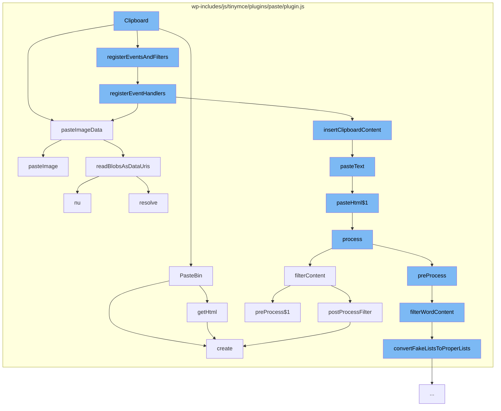

This document will cover the process of handling clipboard data in the TinyMCE editor, which includes:

1. Reading clipboard data
2. Registering event handlers
3. Inserting clipboard content
4. Processing and filtering the content
5. Converting fake lists to proper lists
6. Post processing the content
7. Creating a paste bin
8. Reading blobs as data URIs.



<SwmSnippet path="/wp-includes/js/tinymce/plugins/paste/plugin.js" line="1729">

---

# Reading clipboard data

The function `pasteImageData` is used to read the clipboard data. If the editor settings allow pasting of data images and data is available, it prevents the default event and reads the blobs as data URIs.

```javascript
    var pasteImageData = function (editor, e, rng) {
      var dataTransfer = isClipboardEvent(e) ? e.clipboardData : e.dataTransfer;
      if (editor.settings.paste_data_images && dataTransfer) {
        var images = getImagesFromDataTransfer(dataTransfer);
        if (images.length > 0) {
          e.preventDefault();
          readBlobsAsDataUris(images).get(function (blobResults) {
            if (rng) {
              editor.selection.setRng(rng);
            }
            each(blobResults, function (result) {
              pasteImage(editor, result);
            });
          });
          return true;
        }
      }
      return false;
    };
```

---

</SwmSnippet>

<SwmSnippet path="/wp-includes/js/tinymce/plugins/paste/plugin.js" line="1755">

---

# Registering event handlers

The function `registerEventHandlers` is used to register event handlers for the paste bin. It also handles the insertion of clipboard content.

```javascript
    var registerEventHandlers = function (editor, pasteBin, pasteFormat) {
      var keyboardPasteEvent = value();
      var keyboardPastePlainTextState;
      editor.on('keydown', function (e) {
        function removePasteBinOnKeyUp(e) {
          if (isKeyboardPasteEvent(e) && !e.isDefaultPrevented()) {
            pasteBin.remove();
          }
        }
        if (isKeyboardPasteEvent(e) && !e.isDefaultPrevented()) {
          keyboardPastePlainTextState = e.shiftKey && e.keyCode === 86;
          if (keyboardPastePlainTextState && global$2.webkit && domGlobals.navigator.userAgent.indexOf('Version/') !== -1) {
            return;
          }
          e.stopImmediatePropagation();
          keyboardPasteEvent.set(e);
          window.setTimeout(function () {
            keyboardPasteEvent.clear();
          }, 100);
          if (global$2.ie && keyboardPastePlainTextState) {
            e.preventDefault();
```

---

</SwmSnippet>

<SwmSnippet path="/wp-includes/js/tinymce/plugins/paste/plugin.js" line="1787">

---

# Inserting clipboard content

The function `insertClipboardContent` is used to insert the clipboard content into the editor. It handles both plain text and HTML content.

```javascript
      function insertClipboardContent(clipboardContent, isKeyBoardPaste, plainTextMode, internal) {
        var content, isPlainTextHtml;
        if (hasContentType(clipboardContent, 'text/html')) {
          content = clipboardContent['text/html'];
        } else {
          content = pasteBin.getHtml();
          internal = internal ? internal : InternalHtml.isMarked(content);
          if (pasteBin.isDefaultContent(content)) {
            plainTextMode = true;
          }
        }
        content = Utils.trimHtml(content);
        pasteBin.remove();
        isPlainTextHtml = internal === false && Newlines.isPlainText(content);
        if (!content.length || isPlainTextHtml) {
          plainTextMode = true;
        }
        if (plainTextMode) {
          if (hasContentType(clipboardContent, 'text/plain') && isPlainTextHtml) {
            content = clipboardContent['text/plain'];
          } else {
```

---

</SwmSnippet>

<SwmSnippet path="/wp-includes/js/tinymce/plugins/paste/plugin.js" line="700">

---

# Processing and filtering the content

The function `process` is used to process the pasted content. If the content is from Word, it is preprocessed before being filtered.

```javascript
    var process = function (editor, html, internal) {
      var isWordHtml = WordFilter.isWordContent(html);
      var content = isWordHtml ? WordFilter.preProcess(editor, html) : html;
      return filterContent(editor, content, internal, isWordHtml);
    };
    var ProcessFilters = { process: process };

    var pasteHtml = function (editor, html) {
      editor.insertContent(html, {
        merge: Settings.shouldMergeFormats(editor),
        paste: true
      });
      return true;
    };
    var isAbsoluteUrl = function (url) {
      return /^https?:\/\/[\w\?\-\/+=.&%@~#]+$/i.test(url);
```

---

</SwmSnippet>

<SwmSnippet path="/wp-includes/js/tinymce/plugins/paste/plugin.js" line="374">

---

# Converting fake lists to proper lists

The function `convertFakeListsToProperLists` is used to convert fake lists (like those pasted from Word) to proper HTML lists.

```javascript
    function convertFakeListsToProperLists(node) {
      var currentListNode, prevListNode, lastLevel = 1;
      function getText(node) {
        var txt = '';
        if (node.type === 3) {
          return node.value;
        }
        if (node = node.firstChild) {
          do {
            txt += getText(node);
          } while (node = node.next);
        }
        return txt;
      }
      function trimListStart(node, regExp) {
        if (node.type === 3) {
          if (regExp.test(node.value)) {
            node.value = node.value.replace(regExp, '');
            return false;
          }
        }
```

---

</SwmSnippet>

<SwmSnippet path="/wp-includes/js/tinymce/plugins/paste/plugin.js" line="686">

---

# Post processing the content

The function `postProcessFilter` is used to post process the content after it has been inserted into the editor. It fires the `PastePostProcess` event.

```javascript
    var postProcessFilter = function (editor, html, internal, isWordHtml) {
      var tempBody = editor.dom.create('div', { style: 'display:none' }, html);
      var postProcessArgs = Events.firePastePostProcess(editor, tempBody, internal, isWordHtml);
      return processResult(postProcessArgs.node.innerHTML, postProcessArgs.isDefaultPrevented());
    };
```

---

</SwmSnippet>

<SwmSnippet path="/wp-includes/js/tinymce/plugins/paste/plugin.js" line="1914">

---

# Creating a paste bin

The function `create` is used to create a paste bin. The paste bin is a hidden div where the clipboard content is initially pasted before being processed and inserted into the editor.

```javascript
    var create = function (editor, lastRngCell, pasteBinDefaultContent) {
      var dom = editor.dom, body = editor.getBody();
      var pasteBinElm;
      lastRngCell.set(editor.selection.getRng());
      pasteBinElm = editor.dom.add(getPasteBinParent(editor), 'div', {
        'id': 'mcepastebin',
        'class': 'mce-pastebin',
        'contentEditable': true,
        'data-mce-bogus': 'all',
        'style': 'position: fixed; top: 50%; width: 10px; height: 10px; overflow: hidden; opacity: 0'
      }, pasteBinDefaultContent);
      if (global$2.ie || global$2.gecko) {
        dom.setStyle(pasteBinElm, 'left', dom.getStyle(body, 'direction', true) === 'rtl' ? 65535 : -65535);
      }
      dom.bind(pasteBinElm, 'beforedeactivate focusin focusout', function (e) {
        e.stopPropagation();
      });
      delegatePasteEvents(editor, pasteBinElm, pasteBinDefaultContent);
      pasteBinElm.focus();
      editor.selection.select(pasteBinElm, true);
    };
```

---

</SwmSnippet>

<SwmSnippet path="/wp-includes/js/tinymce/plugins/paste/plugin.js" line="1444">

---

# Reading blobs as data URIs

The function `nu` is used to read blobs as data URIs. It is used in the `pasteImageData` function to read the images from the clipboard data.

```javascript
    var nu = function (baseFn) {
      var data = Option.none();
      var callbacks = [];
      var map = function (f) {
        return nu(function (nCallback) {
          get(function (data) {
            nCallback(f(data));
          });
        });
      };
      var get = function (nCallback) {
        if (isReady()) {
          call(nCallback);
        } else {
          callbacks.push(nCallback);
        }
      };
      var set = function (x) {
        data = Option.some(x);
        run(callbacks);
        callbacks = [];
```

---

</SwmSnippet>

&nbsp;

*This is an auto-generated document by Swimm AI 🌊 and has not yet been verified by a human*

<SwmMeta version="3.0.0" repo-id="Z2l0aHViJTNBJTNBbXl3ZWJzaXRlZGVtbyUzQSUzQWdpbGFkbmF2b3Q=" repo-name="mywebsitedemo" doc-type="flows"><sup>Powered by [Swimm](/)</sup></SwmMeta>
