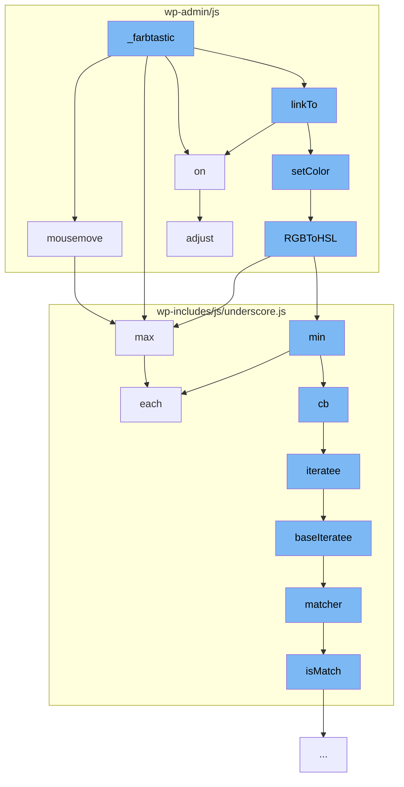

This document will cover the process of color manipulation in the WordPress admin interface, specifically through the `_farbtastic::wp-admin/js/farbtastic.js` function. We'll cover:

1. How mouse movements are tracked
2. How color values are linked and set
3. How RGB values are converted to HSL
4. How maximum and minimum values are determined.



<SwmSnippet path="/wp-admin/js/farbtastic.js" line="138">

---

# Tracking Mouse Movements

The `mousemove` function in `farbtastic.js` is responsible for tracking the user's mouse movements when interacting with the color picker. It calculates the new HSL parameters based on the mouse's position relative to the color picker center.

```javascript
  /**
   * Mousemove handler
   */
  fb.mousemove = function (event) {
    // Get coordinates relative to color picker center
    var pos = fb.widgetCoords(event);

    // Set new HSL parameters
    if (fb.circleDrag) {
      var hue = Math.atan2(pos.x, -pos.y) / 6.28;
      if (hue < 0) hue += 1;
      fb.setHSL([hue, fb.hsl[1], fb.hsl[2]]);
    }
    else {
      var sat = Math.max(0, Math.min(1, -(pos.x / fb.square) + .5));
      var lum = Math.max(0, Math.min(1, -(pos.y / fb.square) + .5));
      fb.setHSL([fb.hsl[0], sat, lum]);
    }
    return false;
  };
```

---

</SwmSnippet>

<SwmSnippet path="/wp-admin/js/farbtastic.js" line="249">

---

# Linking and Setting Color Values

The `linkTo` and `setColor` functions are used to link the color picker to an input field and set the color value respectively. The `setColor` function calls the `RGBToHSL` function to convert the color value from RGB to HSL.

```javascript
  fb.RGBToHSL = function (rgb) {
    var min, max, delta, h, s, l;
    var r = rgb[0], g = rgb[1], b = rgb[2];
    min = Math.min(r, Math.min(g, b));
    max = Math.max(r, Math.max(g, b));
    delta = max - min;
    l = (min + max) / 2;
    s = 0;
    if (l > 0 && l < 1) {
      s = delta / (l < 0.5 ? (2 * l) : (2 - 2 * l));
    }
    h = 0;
    if (delta > 0) {
      if (max == r && max != g) h += (g - b) / delta;
      if (max == g && max != b) h += (2 + (b - r) / delta);
      if (max == b && max != r) h += (4 + (r - g) / delta);
      h /= 6;
    }
    return [h, s, l];
  };
```

---

</SwmSnippet>

<SwmSnippet path="/wp-admin/js/farbtastic.js" line="249">

---

# Converting RGB to HSL

The `RGBToHSL` function is used to convert the color value from RGB to HSL. This is necessary because HSL is easier to manipulate programmatically, especially for operations like changing the hue, saturation, or lightness.

```javascript
  fb.RGBToHSL = function (rgb) {
    var min, max, delta, h, s, l;
    var r = rgb[0], g = rgb[1], b = rgb[2];
    min = Math.min(r, Math.min(g, b));
    max = Math.max(r, Math.max(g, b));
    delta = max - min;
    l = (min + max) / 2;
    s = 0;
    if (l > 0 && l < 1) {
      s = delta / (l < 0.5 ? (2 * l) : (2 - 2 * l));
    }
    h = 0;
    if (delta > 0) {
      if (max == r && max != g) h += (g - b) / delta;
      if (max == g && max != b) h += (2 + (b - r) / delta);
      if (max == b && max != r) h += (4 + (r - g) / delta);
      h /= 6;
    }
    return [h, s, l];
  };
```

---

</SwmSnippet>

<SwmSnippet path="/wp-includes/js/underscore.js" line="1466">

---

# Determining Maximum and Minimum Values

The `max` and `min` functions in `underscore.js` are used to determine the maximum and minimum values from a list of numbers. These functions are used in various parts of the color manipulation process, such as determining the maximum and minimum RGB values.

```javascript
  // Return the maximum element (or element-based computation).
  function max(obj, iteratee, context) {
    var result = -Infinity, lastComputed = -Infinity,
        value, computed;
    if (iteratee == null || (typeof iteratee == 'number' && typeof obj[0] != 'object' && obj != null)) {
      obj = isArrayLike(obj) ? obj : values(obj);
      for (var i = 0, length = obj.length; i < length; i++) {
        value = obj[i];
        if (value != null && value > result) {
          result = value;
        }
      }
    } else {
      iteratee = cb(iteratee, context);
      each(obj, function(v, index, list) {
        computed = iteratee(v, index, list);
        if (computed > lastComputed || (computed === -Infinity && result === -Infinity)) {
          result = v;
          lastComputed = computed;
        }
      });
```

---

</SwmSnippet>

&nbsp;

*This is an auto-generated document by Swimm AI 🌊 and has not yet been verified by a human*

<SwmMeta version="3.0.0" repo-id="Z2l0aHViJTNBJTNBbXl3ZWJzaXRlZGVtbyUzQSUzQWdpbGFkbmF2b3Q=" repo-name="mywebsitedemo" doc-type="flows"><sup>Powered by [Swimm](/)</sup></SwmMeta>
