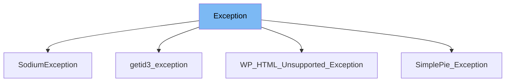

This document will cover the following aspects of the Exception class in the wp-includes/PHPMailer/Exception.php file:

1. What is Exception
2. Variables and functions in Exception
3. Usage example of Exception



# What is Exception

The `Exception` class in the wp-includes/PHPMailer/Exception.php file is a custom exception handler for the PHPMailer library. It extends the base PHP `Exception` class and provides a method to format error messages in a user-friendly way.

<SwmSnippet path="/wp-includes/PHPMailer/Exception.php" line="29">

---

# Variables and functions

The `Exception` class does not define any variables. It only contains one function, `errorMessage()`, which is used to format the error message output.

```hack
class Exception extends \Exception
{
    /**
     * Prettify error message output.
     *
     * @return string
     */
    public function errorMessage()
    {
        return '<strong>' . htmlspecialchars($this->getMessage(), ENT_COMPAT | ENT_HTML401) . "</strong><br />\n";
    }
}
```

---

</SwmSnippet>

<SwmSnippet path="/wp-includes/PHPMailer/Exception.php" line="36">

---

The `errorMessage()` function is used to prettify error message output. It returns a string that contains the error message wrapped in HTML tags for better readability.

```hack
    public function errorMessage()
    {
        return '<strong>' . htmlspecialchars($this->getMessage(), ENT_COMPAT | ENT_HTML401) . "</strong><br />\n";
    }
```

---

</SwmSnippet>

<SwmSnippet path="/wp-includes/sodium_compat/src/SodiumException.php" line="1">

---

# Usage example

The `SodiumException` class in the wp-includes/sodium_compat/src/SodiumException.php file is an example of how the `Exception` class is used. `SodiumException` extends the `Exception` class, inheriting its functionality.

```hack
<?php

if (!class_exists('SodiumException', false)) {
    /**
     * Class SodiumException
     */
    class SodiumException extends Exception
    {

    }
}

```

---

</SwmSnippet>

&nbsp;

*This is an auto-generated document by Swimm AI 🌊 and has not yet been verified by a human*

<SwmMeta version="3.0.0" repo-id="Z2l0aHViJTNBJTNBbXl3ZWJzaXRlZGVtbyUzQSUzQWdpbGFkbmF2b3Q=" repo-name="mywebsitedemo" doc-type="class"><sup>Powered by [Swimm](/)</sup></SwmMeta>
