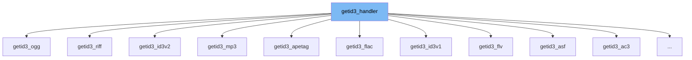

This document will cover the class getid3_handler. We'll cover:

1. What is getid3_handler
2. Variables and functions of getid3_handler
3. Usage example of getid3_handler in getid3_lyrics3



# What is getid3_handler

getid3_handler is an abstract class in the getID3 library. It provides a base for all other handler classes in the library. It contains methods for analyzing file pointers or strings, and for handling errors and warnings.

<SwmSnippet path="/wp-includes/ID3/getid3.php" line="2102">

---

# Variables and functions of getid3_handler

The variable `getid3` is a pointer to the getID3 instance.

```hack
	/**
	* @var getID3
	*/
	protected $getid3;                       // pointer
```

---

</SwmSnippet>

<SwmSnippet path="/wp-includes/ID3/getid3.php" line="2112">

---

The variable `data_string_flag` is a boolean flag indicating whether the handler is analyzing a file pointer or a string.

```hack
	protected $data_string_flag     = false;

```

---

</SwmSnippet>

<SwmSnippet path="/wp-includes/ID3/getid3.php" line="2119">

---

The variable `data_string` is the string to analyze, if the handler is in string mode.

```hack
	protected $data_string          = '';

	/**
```

---

</SwmSnippet>

<SwmSnippet path="/wp-includes/ID3/getid3.php" line="2126">

---

The variable `data_string_position` is the current seek position in the string being analyzed.

```hack
	protected $data_string_position = 0;

```

---

</SwmSnippet>

<SwmSnippet path="/wp-includes/ID3/getid3.php" line="2133">

---

The variable `data_string_length` is the length of the string being analyzed.

```hack
	protected $data_string_length   = 0;
```

---

</SwmSnippet>

<SwmSnippet path="/wp-includes/ID3/getid3.php" line="2138">

---

The variable `dependency_to` is a string representing the module that this handler is a dependency for.

```hack
	private $dependency_to;
```

---

</SwmSnippet>

<SwmSnippet path="/wp-includes/ID3/getid3.php" line="2159">

---

The `Analyze` function is an abstract method that must be implemented by all subclasses. It is used to analyze the file or string.

```hack
	abstract public function Analyze();
```

---

</SwmSnippet>

<SwmSnippet path="/wp-includes/ID3/getid3.php" line="2166">

---

The `AnalyzeString` function is used to analyze a string. It sets the handler to string mode, saves some info, resets some info, analyzes the string, restores the info, and exits string mode.

```hack
	public function AnalyzeString($string) {
		// Enter string mode
		$this->setStringMode($string);

		// Save info
		$saved_avdataoffset = $this->getid3->info['avdataoffset'];
		$saved_avdataend    = $this->getid3->info['avdataend'];
		$saved_filesize     = (isset($this->getid3->info['filesize']) ? $this->getid3->info['filesize'] : null); // may be not set if called as dependency without openfile() call

		// Reset some info
		$this->getid3->info['avdataoffset'] = 0;
		$this->getid3->info['avdataend']    = $this->getid3->info['filesize'] = $this->data_string_length;

		// Analyze
		$this->Analyze();

		// Restore some info
		$this->getid3->info['avdataoffset'] = $saved_avdataoffset;
		$this->getid3->info['avdataend']    = $saved_avdataend;
		$this->getid3->info['filesize']     = $saved_filesize;

```

---

</SwmSnippet>

<SwmSnippet path="/wp-includes/ID3/getid3.php" line="2191">

---

The `setStringMode` function is used to set the handler to string mode and set the string to be analyzed.

```hack
	/**
	 * @param string $string
	 */
	public function setStringMode($string) {
```

---

</SwmSnippet>

<SwmSnippet path="/wp-includes/ID3/getid3.php" line="2196">

---

The `ftell` function is used to get the current position in the file or string being analyzed.

```hack
		$this->data_string        = $string;
```

---

</SwmSnippet>

<SwmSnippet path="/wp-includes/ID3/getid3.php" line="2198">

---

The `fread` function is used to read a specified number of bytes from the file or string being analyzed.

```hack
	}

	/**
	 * @phpstan-impure
	 *
	 * @return int|bool
	 */
	protected function ftell() {
		if ($this->data_string_flag) {
			return $this->data_string_position;
		}
		return ftell($this->getid3->fp);
	}

	/**
	 * @param int $bytes
	 *
	 * @phpstan-impure
	 *
	 * @return string|false
	 *
```

---

</SwmSnippet>

<SwmSnippet path="/wp-includes/ID3/getid3.php" line="2258">

---

The `fseek` function is used to move the file pointer to a specified location in the file or string being analyzed.

```hack
	/**
	 * @param int $bytes
	 * @param int $whence
	 *
	 * @phpstan-impure
	 *
	 * @return int
	 *
	 * @throws getid3_exception
	 */
	protected function fseek($bytes, $whence=SEEK_SET) {
		if ($this->data_string_flag) {
			switch ($whence) {
				case SEEK_SET:
					$this->data_string_position = $bytes;
					break;

```

---

</SwmSnippet>

<SwmSnippet path="/wp-includes/ID3/getid3.php" line="2276">

---

The `fgets` function is used to read a line from the file or string being analyzed.

```hack
					$this->data_string_position += $bytes;
					break;

				case SEEK_END:
					$this->data_string_position = $this->data_string_length + $bytes;
					break;
			}
			return 0; // fseek returns 0 on success
		}

		$pos = $bytes;
		if ($whence == SEEK_CUR) {
			$pos = $this->ftell() + $bytes;
		} elseif ($whence == SEEK_END) {
			$pos = $this->getid3->info['filesize'] + $bytes;
		}
		if (!getid3_lib::intValueSupported($pos)) {
			throw new getid3_exception('cannot fseek('.$pos.') because beyond PHP filesystem limit', 10);
		}

		// https://github.com/JamesHeinrich/getID3/issues/327
```

---

</SwmSnippet>

<SwmSnippet path="/wp-includes/ID3/getid3.php" line="2361">

---

The `feof` function is used to check if the end of the file or string has been reached.

```hack
	/**
```

---

</SwmSnippet>

<SwmSnippet path="/wp-includes/ID3/getid3.php" line="2363">

---

The `saveAttachment` function is used to save an attachment from the file being analyzed. It can save the attachment to a specified directory, or return it as a string.

```hack
	 *
	 * @return bool
	 */
	protected function feof() {
		if ($this->data_string_flag) {
			return $this->data_string_position >= $this->data_string_length;
		}
		return feof($this->getid3->fp);
	}

	/**
	 * @param string $module
	 *
	 * @return bool
	 */
	final protected function isDependencyFor($module) {
		return $this->dependency_to == $module;
	}

	/**
	 * @param string $text
```

---

</SwmSnippet>

<SwmSnippet path="/wp-includes/ID3/getid3.php" line="2391">

---

The `isDependencyFor` function is used to check if this handler is a dependency for a specified module.

```hack
	}
```

---

</SwmSnippet>

<SwmSnippet path="/wp-includes/ID3/getid3.php" line="2393">

---

The `error` function is used to log an error message.

```hack
	/**
```

---

</SwmSnippet>

<SwmSnippet path="/wp-includes/ID3/getid3.php" line="2395">

---

The `warning` function is used to log a warning message.

```hack
	 *
```

---

</SwmSnippet>

<SwmSnippet path="/wp-includes/ID3/getid3.php" line="2397">

---

The `notice` function is used to log a notice message.

```hack
	 */
```

---

</SwmSnippet>

&nbsp;

*This is an auto-generated document by Swimm AI 🌊 and has not yet been verified by a human*

<SwmMeta version="3.0.0" repo-id="Z2l0aHViJTNBJTNBbXl3ZWJzaXRlZGVtbyUzQSUzQWdpbGFkbmF2b3Q=" repo-name="mywebsitedemo" doc-type="class"><sup>Powered by [Swimm](/)</sup></SwmMeta>
