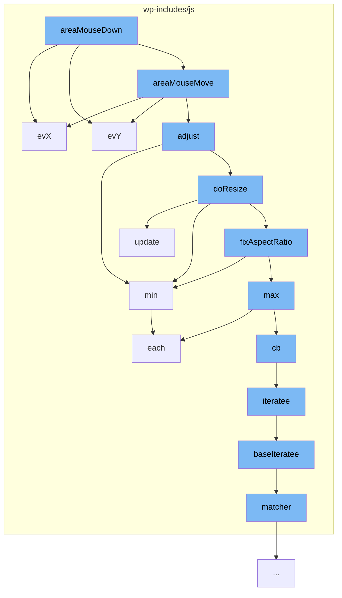

This document will cover the process of image area selection in the WordPress project, which includes:

1. Mouse down event handling
2. Mouse move event handling
3. Adjusting the selection area
4. Resizing the selection area
5. Fixing the aspect ratio of the selection area.



<SwmSnippet path="/wp-includes/js/imgareaselect/jquery.imgareaselect.js" line="191">

---

# Mouse down event handling

The function `evX` is used to translate the X coordinate of the mouse down event to the viewport coordinate system.

```javascript
    function evX(event) {
        return max(event.pageX || 0, touchCoords(event).x) - parOfs.left;
    }
```

---

</SwmSnippet>

<SwmSnippet path="/wp-includes/js/imgareaselect/jquery.imgareaselect.js" line="191">

---

# Mouse move event handling

The function `evX` is also used during the mouse move event to continuously update the X coordinate of the selection area.

```javascript
    function evX(event) {
        return max(event.pageX || 0, touchCoords(event).x) - parOfs.left;
    }
```

---

</SwmSnippet>

<SwmSnippet path="/wp-includes/js/imgareaselect/jquery.imgareaselect.js" line="331">

---

# Adjusting the selection area

The function `update` is used to update the position and size of the selection area and its related elements.

```javascript
    /**
     * Update plugin elements
     *
     * @param resetKeyPress
     *            If set to <code>false</code>, this instance's keypress
     *            event handler is not activated
     */
    function update(resetKeyPress) {
        /* If plugin elements are hidden, do nothing */
        if (!shown) return;

        /*
         * Set the position and size of the container box and the selection area
         * inside it
         */
        $box.css({ left: viewX(selection.x1), top: viewY(selection.y1) })
            .add($area).width(w = selection.width).height(h = selection.height);

        /*
         * Reset the position of selection area, borders, and handles (IE6/IE7
         * position them incorrectly if we don't do this)
```

---

</SwmSnippet>

<SwmSnippet path="/wp-includes/js/underscore.js" line="1491">

---

# Resizing the selection area

The function `min` from the underscore.js library is used to calculate the minimum value for resizing the selection area.

```javascript
  // Return the minimum element (or element-based computation).
  function min(obj, iteratee, context) {
    var result = Infinity, lastComputed = Infinity,
        value, computed;
    if (iteratee == null || (typeof iteratee == 'number' && typeof obj[0] != 'object' && obj != null)) {
      obj = isArrayLike(obj) ? obj : values(obj);
      for (var i = 0, length = obj.length; i < length; i++) {
        value = obj[i];
        if (value != null && value < result) {
          result = value;
        }
      }
    } else {
      iteratee = cb(iteratee, context);
      each(obj, function(v, index, list) {
        computed = iteratee(v, index, list);
        if (computed < lastComputed || (computed === Infinity && result === Infinity)) {
          result = v;
          lastComputed = computed;
        }
      });
```

---

</SwmSnippet>

<SwmSnippet path="/wp-includes/js/underscore.js" line="1491">

---

# Fixing the aspect ratio of the selection area

The function `min` is also used in the `fixAspectRatio` function to maintain the aspect ratio of the selection area during resizing.

```javascript
  // Return the minimum element (or element-based computation).
  function min(obj, iteratee, context) {
    var result = Infinity, lastComputed = Infinity,
        value, computed;
    if (iteratee == null || (typeof iteratee == 'number' && typeof obj[0] != 'object' && obj != null)) {
      obj = isArrayLike(obj) ? obj : values(obj);
      for (var i = 0, length = obj.length; i < length; i++) {
        value = obj[i];
        if (value != null && value < result) {
          result = value;
        }
      }
    } else {
      iteratee = cb(iteratee, context);
      each(obj, function(v, index, list) {
        computed = iteratee(v, index, list);
        if (computed < lastComputed || (computed === Infinity && result === Infinity)) {
          result = v;
          lastComputed = computed;
        }
      });
```

---

</SwmSnippet>

&nbsp;

*This is an auto-generated document by Swimm AI 🌊 and has not yet been verified by a human*

<SwmMeta version="3.0.0" repo-id="Z2l0aHViJTNBJTNBbXl3ZWJzaXRlZGVtbyUzQSUzQWdpbGFkbmF2b3Q=" repo-name="mywebsitedemo" doc-type="flows"><sup>Powered by [Swimm](/)</sup></SwmMeta>
