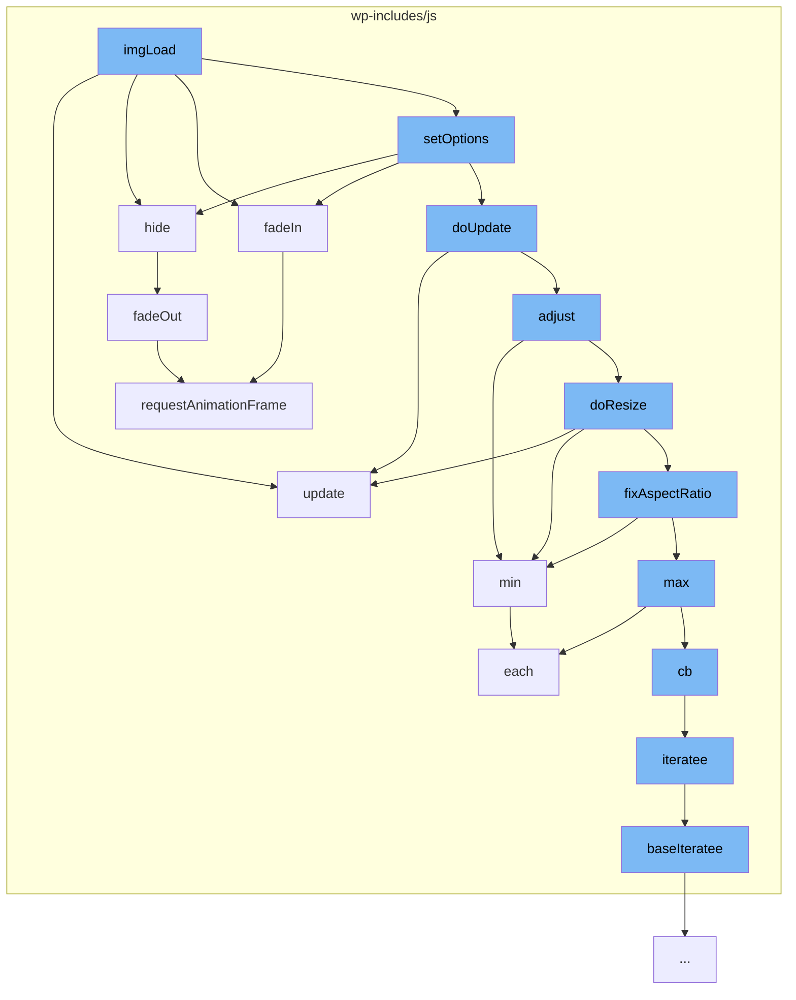

This document will cover the process of image selection and manipulation in the WordPress project. We'll cover:

1. Loading the image
2. Updating the image selection
3. Hiding the image
4. Fading in the image
5. Setting options for the image
6. Updating the image after setting options
7. Adjusting the image
8. Resizing the image
9. Fixing the aspect ratio of the image.



<SwmSnippet path="/wp-includes/js/imgareaselect/jquery.imgareaselect.js" line="1">

---

# Loading the image

The `imgLoad` function initializes the image selection process. It calls several other functions to manipulate the image.

```javascript
/*
 * imgAreaSelect jQuery plugin
 * version 0.9.10-wp-6.2
 *
 * Copyright (c) 2008-2013 Michal Wojciechowski (odyniec.net)
 *
 * Dual licensed under the MIT (MIT-LICENSE.txt)
 * and GPL (GPL-LICENSE.txt) licenses.
 *
 * https://github.com/odyniec/imgareaselect
```

---

</SwmSnippet>

<SwmSnippet path="/wp-includes/js/imgareaselect/jquery.imgareaselect.js" line="331">

---

# Updating the image selection

The `update` function updates the plugin elements. It sets the position and size of the container box and the selection area inside it. It also arranges the outer area elements and handles.

```javascript
    /**
     * Update plugin elements
     *
     * @param resetKeyPress
     *            If set to <code>false</code>, this instance's keypress
     *            event handler is not activated
     */
    function update(resetKeyPress) {
        /* If plugin elements are hidden, do nothing */
        if (!shown) return;

        /*
         * Set the position and size of the container box and the selection area
         * inside it
         */
        $box.css({ left: viewX(selection.x1), top: viewY(selection.y1) })
            .add($area).width(w = selection.width).height(h = selection.height);

        /*
         * Reset the position of selection area, borders, and handles (IE6/IE7
         * position them incorrectly if we don't do this)
```

---

</SwmSnippet>

<SwmSnippet path="/wp-includes/js/imgareaselect/jquery.imgareaselect.js" line="444">

---

# Hiding the image

The `hide` function hides or fades out an element. It uses the jQuery `fadeOut` function if a fade speed is set, otherwise it uses the jQuery `hide` function.

```javascript
    /**
     * Hide or fade out an element (or multiple elements)
     *
     * @param $elem
     *            A jQuery object containing the element(s) to hide/fade out
     * @param fn
     *            Callback function to be called when fadeOut() completes
     */
    function hide($elem, fn) {
        options.fadeSpeed ? $elem.fadeOut(options.fadeSpeed, fn) : $elem.hide();
    }
```

---

</SwmSnippet>

<SwmSnippet path="/wp-includes/js/mediaelement/mediaelement.js" line="3938">

---

# Fading in the image

The `fadeIn` function uses the `requestAnimationFrame` function to create a smooth transition effect when the image is displayed.

```javascript
	if (!window.requestAnimationFrame) window.requestAnimationFrame = function (callback) {
		var currTime = new Date().getTime();
		var timeToCall = Math.max(0, 16 - (currTime - lastTime));
		var id = window.setTimeout(function () {
			callback(currTime + timeToCall);
		}, timeToCall);
		lastTime = currTime + timeToCall;
		return id;
	};
```

---

</SwmSnippet>

<SwmSnippet path="/wp-includes/js/imgareaselect/jquery.imgareaselect.js" line="1">

---

# Setting options for the image

The `setOptions` function is called to set various options for the image. It calls the `hide`, `fadeIn`, and `doUpdate` functions.

```javascript
/*
 * imgAreaSelect jQuery plugin
 * version 0.9.10-wp-6.2
 *
 * Copyright (c) 2008-2013 Michal Wojciechowski (odyniec.net)
 *
 * Dual licensed under the MIT (MIT-LICENSE.txt)
 * and GPL (GPL-LICENSE.txt) licenses.
 *
 * https://github.com/odyniec/imgareaselect
```

---

</SwmSnippet>

<SwmSnippet path="/wp-includes/js/imgareaselect/jquery.imgareaselect.js" line="331">

---

# Updating the image after setting options

The `doUpdate` function is called after setting options. It updates the plugin elements and calls the `update` and `adjust` functions.

```javascript
    /**
     * Update plugin elements
     *
     * @param resetKeyPress
     *            If set to <code>false</code>, this instance's keypress
     *            event handler is not activated
     */
    function update(resetKeyPress) {
        /* If plugin elements are hidden, do nothing */
        if (!shown) return;

        /*
         * Set the position and size of the container box and the selection area
         * inside it
         */
        $box.css({ left: viewX(selection.x1), top: viewY(selection.y1) })
            .add($area).width(w = selection.width).height(h = selection.height);

        /*
         * Reset the position of selection area, borders, and handles (IE6/IE7
         * position them incorrectly if we don't do this)
```

---

</SwmSnippet>

<SwmSnippet path="/wp-includes/js/imgareaselect/jquery.imgareaselect.js" line="1">

---

# Adjusting the image

The `adjust` function adjusts the image. It calls the `min` function from the underscore.js library and the `doResize` function.

```javascript
/*
 * imgAreaSelect jQuery plugin
 * version 0.9.10-wp-6.2
 *
 * Copyright (c) 2008-2013 Michal Wojciechowski (odyniec.net)
 *
 * Dual licensed under the MIT (MIT-LICENSE.txt)
 * and GPL (GPL-LICENSE.txt) licenses.
 *
 * https://github.com/odyniec/imgareaselect
```

---

</SwmSnippet>

<SwmSnippet path="/wp-includes/js/imgareaselect/jquery.imgareaselect.js" line="1">

---

# Resizing the image

The `doResize` function resizes the image. It calls the `update` function, the `min` function from the underscore.js library, and the `fixAspectRatio` function.

```javascript
/*
 * imgAreaSelect jQuery plugin
 * version 0.9.10-wp-6.2
 *
 * Copyright (c) 2008-2013 Michal Wojciechowski (odyniec.net)
 *
 * Dual licensed under the MIT (MIT-LICENSE.txt)
 * and GPL (GPL-LICENSE.txt) licenses.
 *
 * https://github.com/odyniec/imgareaselect
```

---

</SwmSnippet>

<SwmSnippet path="/wp-includes/js/imgareaselect/jquery.imgareaselect.js" line="1">

---

# Fixing the aspect ratio of the image

The `fixAspectRatio` function fixes the aspect ratio of the image. It calls the `min` and `max` functions from the underscore.js library.

```javascript
/*
 * imgAreaSelect jQuery plugin
 * version 0.9.10-wp-6.2
 *
 * Copyright (c) 2008-2013 Michal Wojciechowski (odyniec.net)
 *
 * Dual licensed under the MIT (MIT-LICENSE.txt)
 * and GPL (GPL-LICENSE.txt) licenses.
 *
 * https://github.com/odyniec/imgareaselect
```

---

</SwmSnippet>

&nbsp;

*This is an auto-generated document by Swimm AI 🌊 and has not yet been verified by a human*

<SwmMeta version="3.0.0" repo-id="Z2l0aHViJTNBJTNBbXl3ZWJzaXRlZGVtbyUzQSUzQWdpbGFkbmF2b3Q=" repo-name="mywebsitedemo" doc-type="flows"><sup>Powered by [Swimm](/)</sup></SwmMeta>
