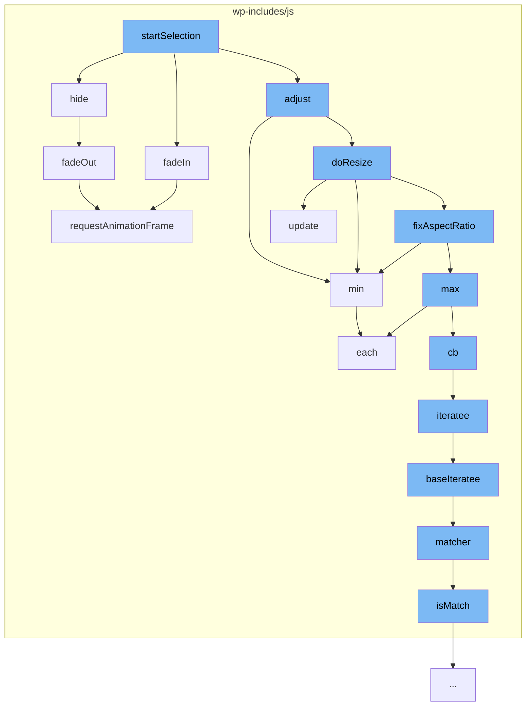

This document will cover the process of image selection in the WordPress project, which includes:

1. Starting the selection process
2. Adjusting the selection
3. Resizing the selection
4. Fixing the aspect ratio of the selection
5. Hiding the selection



<SwmSnippet path="/wp-includes/js/imgareaselect/jquery.imgareaselect.js" line="1">

---

# Starting the selection process

The `startSelection` function initiates the image selection process. It calls the `hide`, `fadeIn`, and `adjust` functions to prepare the image for selection.

```javascript
/*
 * imgAreaSelect jQuery plugin
 * version 0.9.10-wp-6.2
 *
 * Copyright (c) 2008-2013 Michal Wojciechowski (odyniec.net)
 *
 * Dual licensed under the MIT (MIT-LICENSE.txt)
 * and GPL (GPL-LICENSE.txt) licenses.
 *
 * https://github.com/odyniec/imgareaselect
```

---

</SwmSnippet>

<SwmSnippet path="/wp-includes/js/imgareaselect/jquery.imgareaselect.js" line="11">

---

# Adjusting the selection

The `adjust` function is used to adjust the selection area. It calls the `min` and `doResize` functions to ensure the selection area is within the image boundaries.

```javascript
 *
 */

(function($) {

/*
 * Math functions will be used extensively, so it's convenient to make a few
 * shortcuts
 */
var abs = Math.abs,
```

---

</SwmSnippet>

<SwmSnippet path="/wp-includes/js/imgareaselect/jquery.imgareaselect.js" line="21">

---

# Resizing the selection

The `doResize` function is used to resize the selection area. It calls the `update`, `min`, and `fixAspectRatio` functions to maintain the aspect ratio while resizing.

```javascript
    max = Math.max,
    min = Math.min,
    floor = Math.floor;

/**
 * Create a new HTML div element
 *
 * @return A jQuery object representing the new element
 */
function div() {
```

---

</SwmSnippet>

<SwmSnippet path="/wp-includes/js/imgareaselect/jquery.imgareaselect.js" line="31">

---

# Fixing the aspect ratio of the selection

The `fixAspectRatio` function is used to maintain the aspect ratio of the selection. It calls the `min` and `max` functions to calculate the correct aspect ratio.

```javascript
    return $('<div/>');
}

/**
 * imgAreaSelect initialization
 *
 * @param img
 *            A HTML image element to attach the plugin to
 * @param options
 *            An options object
```

---

</SwmSnippet>

<SwmSnippet path="/wp-includes/js/imgareaselect/jquery.imgareaselect.js" line="444">

---

# Hiding the selection

The `hide` function is used to hide or fade out the selection area. It calls the `fadeOut` function to smoothly hide the selection area.

```javascript
    /**
     * Hide or fade out an element (or multiple elements)
     *
     * @param $elem
     *            A jQuery object containing the element(s) to hide/fade out
     * @param fn
     *            Callback function to be called when fadeOut() completes
     */
    function hide($elem, fn) {
        options.fadeSpeed ? $elem.fadeOut(options.fadeSpeed, fn) : $elem.hide();
    }
```

---

</SwmSnippet>

&nbsp;

*This is an auto-generated document by Swimm AI 🌊 and has not yet been verified by a human*

<SwmMeta version="3.0.0" repo-id="Z2l0aHViJTNBJTNBbXl3ZWJzaXRlZGVtbyUzQSUzQWdpbGFkbmF2b3Q=" repo-name="mywebsitedemo" doc-type="flows"><sup>Powered by [Swimm](/)</sup></SwmMeta>
