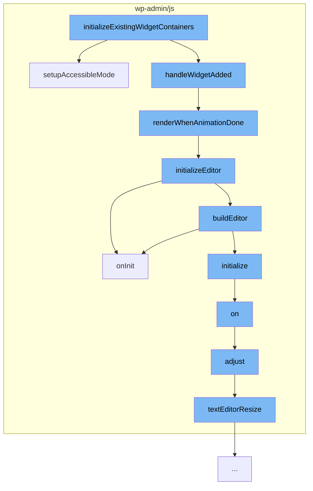

This document will cover the process of initializing existing widget containers in the <SwmToken path="/wp-admin/js/widgets/text-widgets.js" pos="198:15:15" line-data="					 * callbacks. See &lt;https://core.trac.wordpress.org/ticket/33507&gt;.">`wordpress`</SwmToken> project, which includes:

1. Setting up the widget in accessibility mode
2. Rendering the widget once the widget parent's container finishes animating
3. Initializing the editor
4. Adjusting the toolbars heights and positions
5. Resizing the text editor depending on the old text length.



<SwmSnippet path="/wp-admin/js/widgets/text-widgets.js" line="440">

---

# Setting up the widget in accessibility mode

The function <SwmToken path="/wp-admin/js/widgets/text-widgets.js" pos="447:3:3" line-data="	component.setupAccessibleMode = function setupAccessibleMode() {">`setupAccessibleMode`</SwmToken> is used to set up the widget in accessibility mode. It checks if the widget form exists and if it's in the list of <SwmToken path="/wp-admin/js/widgets/text-widgets.js" pos="455:12:12" line-data="		if ( -1 === component.idBases.indexOf( idBase ) ) {">`idBases`</SwmToken>. If the widget is in legacy mode, it bypasses using <SwmToken path="/wp-admin/js/widgets/text-widgets.js" pos="459:7:7" line-data="		// Bypass using TinyMCE when widget is in legacy mode.">`TinyMCE`</SwmToken>. It then creates a new instance of <SwmToken path="/wp-admin/js/widgets/text-widgets.js" pos="19:3:3" line-data="	component.TextWidgetControl = Backbone.View.extend(/** @lends wp.textWidgets.TextWidgetControl.prototype */{">`TextWidgetControl`</SwmToken> and initializes the editor.

```javascript
	/**
	 * Setup widget in accessibility mode.
	 *
	 * @memberOf wp.textWidgets
	 *
	 * @return {void}
	 */
	component.setupAccessibleMode = function setupAccessibleMode() {
		var widgetForm, idBase, widgetControl, fieldContainer, syncContainer;
		widgetForm = $( '.editwidget > form' );
		if ( 0 === widgetForm.length ) {
			return;
		}

		idBase = widgetForm.find( '.id_base' ).val();
		if ( -1 === component.idBases.indexOf( idBase ) ) {
			return;
		}

		// Bypass using TinyMCE when widget is in legacy mode.
		if ( ! widgetForm.find( '.visual' ).val() ) {
```

---

</SwmSnippet>

<SwmSnippet path="/wp-admin/js/widgets/text-widgets.js" line="424">

---

# Rendering the widget once the widget parent's container finishes animating

The function <SwmToken path="/wp-admin/js/widgets/text-widgets.js" pos="430:1:1" line-data="		renderWhenAnimationDone = function() {">`renderWhenAnimationDone`</SwmToken> is used to render the widget once the widget parent's container finishes animating. It checks if the widget container has the class 'open'. If not, it sets a timeout to call itself again. If it does, it initializes the editor.

```javascript
		/*
		 * Render the widget once the widget parent's container finishes animating,
		 * as the widget-added event fires with a slideDown of the container.
		 * This ensures that the textarea is visible and an iframe can be embedded
		 * with TinyMCE being able to set contenteditable on it.
		 */
		renderWhenAnimationDone = function() {
			if ( ! widgetContainer.hasClass( 'open' ) ) {
				setTimeout( renderWhenAnimationDone, animatedCheckDelay );
			} else {
				widgetControl.initializeEditor();
			}
		};
```

---

</SwmSnippet>

<SwmSnippet path="/wp-admin/js/widgets/text-widgets.js" line="173">

---

# Initializing the editor

The function <SwmToken path="/wp-admin/js/widgets/text-widgets.js" pos="173:1:1" line-data="		initializeEditor: function initializeEditor() {">`initializeEditor`</SwmToken> is used to initialize the editor. It sets up the editor with various settings and binds several events to it. It also builds the editor and initializes it.

```javascript
		initializeEditor: function initializeEditor() {
			var control = this, changeDebounceDelay = 1000, id, textarea, triggerChangeIfDirty, restoreTextMode = false, needsTextareaChangeTrigger = false, previousValue;
			textarea = control.fields.text;
			id = textarea.attr( 'id' );
			previousValue = textarea.val();

			/**
			 * Trigger change if dirty.
			 *
			 * @return {void}
			 */
			triggerChangeIfDirty = function() {
				var updateWidgetBuffer = 300; // See wp.customize.Widgets.WidgetControl._setupUpdateUI() which uses 250ms for updateWidgetDebounced.
				if ( control.editor.isDirty() ) {

					/*
					 * Account for race condition in customizer where user clicks Save & Publish while
					 * focus was just previously given to the editor. Since updates to the editor
					 * are debounced at 1 second and since widget input changes are only synced to
					 * settings after 250ms, the customizer needs to be put into the processing
					 * state during the time between the change event is triggered and updateWidget
```

---

</SwmSnippet>

<SwmSnippet path="/wp-admin/js/editor-expand.js" line="453">

---

# Adjusting the toolbars heights and positions

The function <SwmToken path="/wp-admin/js/editor-expand.js" pos="466:3:3" line-data="		function adjust( event ) {">`adjust`</SwmToken> is used to adjust the toolbars heights and positions based on the scroll position on the page, the active editor mode and the heights of the editor, admin bar and side bar.

```javascript
		/**
		 * Adjusts the toolbars heights and positions.
		 *
		 * Adjusts the toolbars heights and positions based on the scroll position on
		 * the page, the active editor mode and the heights of the editor, admin bar and
		 * side bar.
		 *
		 * @since 4.0.0
		 *
		 * @param {event} event The event that calls this function.
		 *
		 * @return {void}
		 */
		function adjust( event ) {

			// Makes sure we're not in fullscreen mode.
			if ( fullscreen && fullscreen.settings.visible ) {
				return;
			}

			var windowPos = $window.scrollTop(),
```

---

</SwmSnippet>

<SwmSnippet path="/wp-admin/js/editor-expand.js" line="95">

---

# Resizing the text editor depending on the old text length

The function <SwmToken path="/wp-admin/js/editor-expand.js" pos="107:3:3" line-data="		function textEditorResize() {">`textEditorResize`</SwmToken> is used to resize the text editor depending on the old text length. If the current length of the text is smaller than the old text length, it shrinks the text area. Otherwise it resizes the editor to the scroll height.

```javascript
		/**
		 * Resizes the text editor depending on the old text length.
		 *
		 * If there is an mceEditor and it is hidden, it resizes the editor depending
		 * on the old text length. If the current length of the text is smaller than
		 * the old text length, it shrinks the text area. Otherwise it resizes the editor to
		 * the scroll height.
		 *
		 * @since 4.6.1
		 *
		 * @return {void}
		 */
		function textEditorResize() {
			var length = textEditor.value.length;

			if ( mceEditor && ! mceEditor.isHidden() ) {
				return;
			}

			if ( ! mceEditor && initialMode === 'tinymce' ) {
				return;
```

---

</SwmSnippet>

&nbsp;

*This is an auto-generated document by Swimm AI 🌊 and has not yet been verified by a human*

<SwmMeta version="3.0.0" repo-id="Z2l0aHViJTNBJTNBbXl3ZWJzaXRlZGVtbyUzQSUzQWdpbGFkbmF2b3Q=" repo-name="mywebsitedemo"><sup>Powered by [Swimm](https://app.swimm.io/)</sup></SwmMeta>
