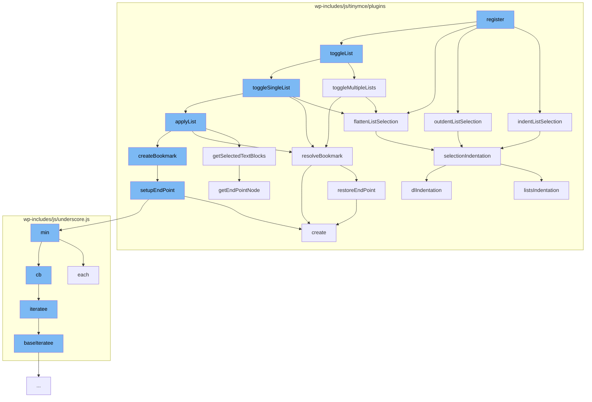

This document will cover the process of managing lists in the TinyMCE editor, which includes:

1. Registering the list plugin
2. Indenting, outdenting, and flattening list selections
3. Toggling between single and multiple lists
4. Applying lists and creating bookmarks
5. Setting up endpoints and restoring them
6. Getting selected text blocks and handling selection indentation.



<SwmSnippet path="/wp-includes/js/tinymce/plugins/lists/plugin.js" line="1">

---

# Registering the list plugin

The `register` function is the entry point for the list plugin. It calls several other functions to manage list operations such as indenting, outdenting, flattening, and toggling lists.

```javascript
(function () {
var lists = (function (domGlobals) {
    'use strict';

    var global = tinymce.util.Tools.resolve('tinymce.PluginManager');

    var global$1 = tinymce.util.Tools.resolve('tinymce.dom.RangeUtils');

    var global$2 = tinymce.util.Tools.resolve('tinymce.dom.TreeWalker');

```

---

</SwmSnippet>

<SwmSnippet path="/wp-includes/js/tinymce/plugins/lists/plugin.js" line="1559">

---

# Indenting, Outdenting, and Flattening List Selections

The `indentListSelection`, `outdentListSelection`, and `flattenListSelection` functions are used to modify the indentation of the selected list items in the editor.

```javascript
    var indentListSelection = function (editor) {
      return selectionIndentation(editor, 'Indent');
    };
    var outdentListSelection = function (editor) {
      return selectionIndentation(editor, 'Outdent');
    };
    var flattenListSelection = function (editor) {
      return selectionIndentation(editor, 'Flatten');
    };
```

---

</SwmSnippet>

<SwmSnippet path="/wp-includes/js/tinymce/plugins/lists/plugin.js" line="1748">

---

# Toggling between Single and Multiple Lists

The `toggleMultipleLists` function is used to switch between single and multiple lists. It calls the `flattenListSelection` function if the parent list is of the same type as the new list.

```javascript
    var toggleMultipleLists = function (editor, parentList, lists, listName, detail) {
      if (parentList.nodeName === listName && !hasListStyleDetail(detail)) {
        flattenListSelection(editor);
      } else {
        var bookmark = Bookmark.createBookmark(editor.selection.getRng(true));
        global$5.each([parentList].concat(lists), function (elm) {
          updateList(editor.dom, elm, listName, detail);
        });
        editor.selection.setRng(Bookmark.resolveBookmark(bookmark));
      }
    };
```

---

</SwmSnippet>

<SwmSnippet path="/wp-includes/js/tinymce/plugins/lists/plugin.js" line="1615">

---

# Applying Lists and Creating Bookmarks

The `getSelectedTextBlocks` function is used to get the selected text blocks in the editor. It calls the `getEndPointNode` function to get the start and end nodes of the selection.

```javascript
    var getSelectedTextBlocks = function (editor, rng, root) {
      var textBlocks = [], dom = editor.dom;
      var startNode = getEndPointNode(editor, rng, true, root);
      var endNode = getEndPointNode(editor, rng, false, root);
      var block;
      var siblings = [];
      for (var node = startNode; node; node = node.nextSibling) {
        siblings.push(node);
        if (node === endNode) {
          break;
        }
      }
      global$5.each(siblings, function (node) {
        if (NodeType.isTextBlock(editor, node)) {
          textBlocks.push(node);
          block = null;
          return;
        }
        if (dom.isBlock(node) || NodeType.isBr(node)) {
          if (NodeType.isBr(node)) {
            dom.remove(node);
```

---

</SwmSnippet>

<SwmSnippet path="/wp-includes/js/tinymce/plugins/lists/plugin.js" line="133">

---

# Setting Up Endpoints and Restoring Them

The `setupEndPoint` function is used to set up the start and end points of the selection. It creates a bookmark at the start or end point of the selection.

```javascript
      var setupEndPoint = function (start) {
        var offsetNode, container, offset;
        container = rng[start ? 'startContainer' : 'endContainer'];
        offset = rng[start ? 'startOffset' : 'endOffset'];
        if (container.nodeType === 1) {
          offsetNode = DOM.create('span', { 'data-mce-type': 'bookmark' });
          if (container.hasChildNodes()) {
            offset = Math.min(offset, container.childNodes.length - 1);
            if (start) {
              container.insertBefore(offsetNode, container.childNodes[offset]);
            } else {
              DOM.insertAfter(offsetNode, container.childNodes[offset]);
            }
          } else {
            container.appendChild(offsetNode);
          }
          container = offsetNode;
          offset = 0;
        }
        bookmark[start ? 'startContainer' : 'endContainer'] = container;
        bookmark[start ? 'startOffset' : 'endOffset'] = offset;
```

---

</SwmSnippet>

<SwmSnippet path="/wp-includes/js/tinymce/plugins/lists/plugin.js" line="1544">

---

# Getting Selected Text Blocks and Handling Selection Indentation

The `selectionIndentation` function is used to handle the indentation of the selected list items. It calls the `listsIndentation` function to indent the selected entries.

```javascript
    var selectionIndentation = function (editor, indentation) {
      var lists = map(Selection.getSelectedListRoots(editor), Element.fromDom);
      var dlItems = map(Selection.getSelectedDlItems(editor), Element.fromDom);
      var isHandled = false;
      if (lists.length || dlItems.length) {
        var bookmark = editor.selection.getBookmark();
        listsIndentation(editor, lists, indentation);
        dlIndentation(editor, indentation, dlItems);
        editor.selection.moveToBookmark(bookmark);
        editor.selection.setRng(Range.normalizeRange(editor.selection.getRng()));
        editor.nodeChanged();
        isHandled = true;
      }
      return isHandled;
    };
```

---

</SwmSnippet>

&nbsp;

*This is an auto-generated document by Swimm AI 🌊 and has not yet been verified by a human*

<SwmMeta version="3.0.0" repo-id="Z2l0aHViJTNBJTNBbXl3ZWJzaXRlZGVtbyUzQSUzQWdpbGFkbmF2b3Q=" repo-name="mywebsitedemo" doc-type="flows"><sup>Powered by [Swimm](/)</sup></SwmMeta>
