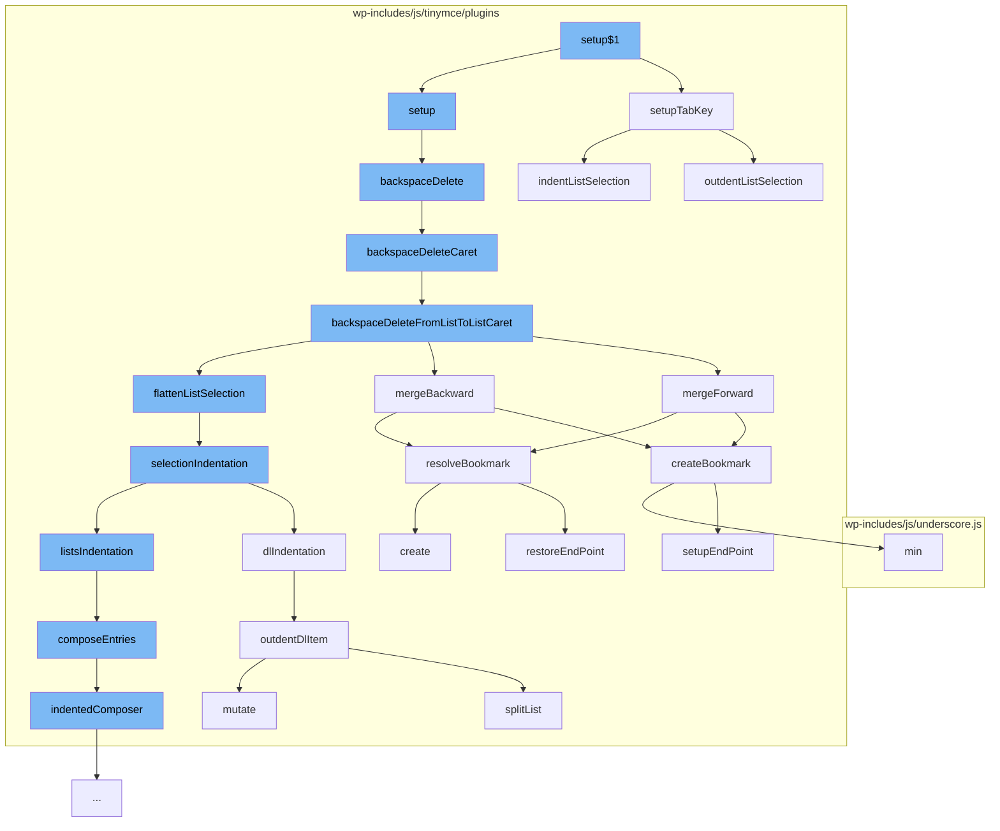

This document will cover the process of handling list manipulations in the TinyMCE editor, which includes:

1. Setting up the Tab key functionality
2. Handling backspace and delete actions
3. Merging list items
4. Indenting and outdenting list items
5. Composing list entries.



<SwmSnippet path="/wp-includes/js/tinymce/plugins/lists/plugin.js" line="2069">

---

# Setting up the Tab key functionality

The `setupTabKey` function is responsible for handling the Tab key press within the editor. It checks if the Tab key is pressed and if it is, it either indents or outdents the list selection based on whether the Shift key is also pressed.

```javascript
    var setupTabKey = function (editor) {
      editor.on('keydown', function (e) {
        if (e.keyCode !== global$3.TAB || global$3.metaKeyPressed(e)) {
          return;
        }
        editor.undoManager.transact(function () {
          if (e.shiftKey ? outdentListSelection(editor) : indentListSelection(editor)) {
            e.preventDefault();
          }
        });
      });
    };
```

---

</SwmSnippet>

<SwmSnippet path="/wp-includes/js/tinymce/plugins/lists/plugin.js" line="2000">

---

# Handling backspace and delete actions

The `backspaceDelete` function handles the backspace and delete actions. It checks if the selection is collapsed and calls the appropriate function based on this.

```javascript
    };
    var backspaceDelete = function (editor, isForward) {
      return editor.selection.isCollapsed() ? backspaceDeleteCaret(editor, isForward) : backspaceDeleteRange(editor);
    };
```

---

</SwmSnippet>

<SwmSnippet path="/wp-includes/js/tinymce/plugins/lists/plugin.js" line="1913">

---

# Merging list items

The `mergeForward` function is responsible for merging list items. If the target list item is empty, it merges into the empty list item. Otherwise, it creates a bookmark, merges the list items, and then sets the selection range to the resolved bookmark.

```javascript
    var mergeForward = function (editor, rng, fromLi, toLi) {
      var dom = editor.dom;
      if (dom.isEmpty(toLi)) {
        mergeIntoEmptyLi(editor, fromLi, toLi);
      } else {
        var bookmark = Bookmark.createBookmark(rng);
        mergeLiElements(dom, fromLi, toLi);
        editor.selection.setRng(Bookmark.resolveBookmark(bookmark));
      }
    };
```

---

</SwmSnippet>

<SwmSnippet path="/wp-includes/js/tinymce/plugins/lists/plugin.js" line="1544">

---

# Indenting and outdenting list items

The `selectionIndentation` function handles the indentation of list items. It gets the selected list roots and selected dl items, and then indents or outdents them based on the `indentation` parameter.

```javascript
    var selectionIndentation = function (editor, indentation) {
      var lists = map(Selection.getSelectedListRoots(editor), Element.fromDom);
      var dlItems = map(Selection.getSelectedDlItems(editor), Element.fromDom);
      var isHandled = false;
      if (lists.length || dlItems.length) {
        var bookmark = editor.selection.getBookmark();
        listsIndentation(editor, lists, indentation);
        dlIndentation(editor, indentation, dlItems);
        editor.selection.moveToBookmark(bookmark);
        editor.selection.setRng(Range.normalizeRange(editor.selection.getRng()));
        editor.nodeChanged();
        isHandled = true;
      }
      return isHandled;
    };
```

---

</SwmSnippet>

<SwmSnippet path="/wp-includes/js/tinymce/plugins/lists/plugin.js" line="1456">

---

# Composing list entries

The `composeEntries` function is responsible for composing list entries. It groups the entries by whether they are indented or not, and then composes them accordingly.

```javascript
    var composeEntries = function (editor, entries) {
      return bind(groupBy(entries, isIndented), function (entries) {
        var groupIsIndented = head(entries).map(isIndented).getOr(false);
        return groupIsIndented ? indentedComposer(editor, entries) : outdentedComposer(editor, entries);
      });
    };
```

---

</SwmSnippet>

&nbsp;

*This is an auto-generated document by Swimm AI 🌊 and has not yet been verified by a human*

<SwmMeta version="3.0.0" repo-id="Z2l0aHViJTNBJTNBbXl3ZWJzaXRlZGVtbyUzQSUzQWdpbGFkbmF2b3Q=" repo-name="mywebsitedemo" doc-type="flows"><sup>Powered by [Swimm](/)</sup></SwmMeta>
