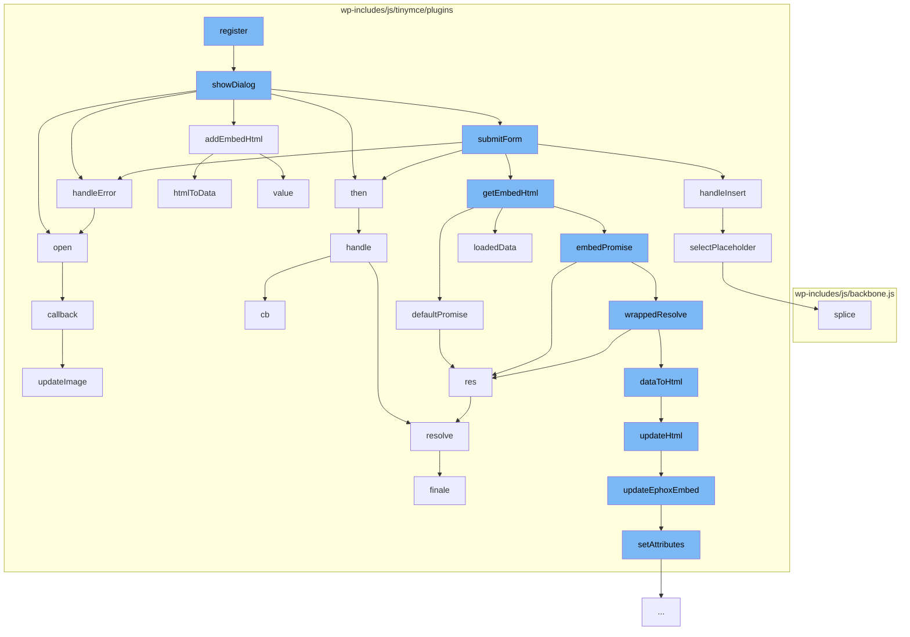

This document will cover the process of media embedding in the TinyMCE editor, which includes:

1. Opening the media dialog
2. Handling media insertion
3. Handling errors
4. Updating the media HTML
5. Updating the media embed
6. Setting attributes for the media
7. Resolving promises
8. Handling color picker
9. Updating the image



<SwmSnippet path="/wp-includes/js/tinymce/plugins/media/plugin.js" line="854">

---

# Opening the media dialog

The `showDialog` function opens the media dialog. It sets up the media source, handles pasting of media, and handles changes to the media source. It also sets up the media embed and handles form submission.

```javascript
    var showDialog = function (editor) {
      var win;
      var data;
      var generalFormItems = [{
          name: 'source1',
          type: 'filepicker',
          filetype: 'media',
          size: 40,
          autofocus: true,
          label: 'Source',
          onpaste: function () {
            setTimeout(function () {
              Service.getEmbedHtml(editor, win.toJSON()).then(addEmbedHtml(win, editor)).catch(handleError(editor));
            }, 1);
          },
          onchange: function (e) {
            Service.getEmbedHtml(editor, win.toJSON()).then(addEmbedHtml(win, editor)).catch(handleError(editor));
            populateMeta(win, e.meta);
          },
          onbeforecall: function (e) {
            e.meta = win.toJSON();
```

---

</SwmSnippet>

<SwmSnippet path="/wp-includes/js/tinymce/plugins/media/plugin.js" line="832">

---

# Handling media insertion

The `handleInsert` function handles the insertion of media into the editor. It selects the placeholder for the media and triggers a node change in the editor.

```javascript
    var handleInsert = function (editor, html) {
      var beforeObjects = editor.dom.select('img[data-mce-object]');
      editor.insertContent(html);
      selectPlaceholder(editor, beforeObjects);
      editor.nodeChanged();
    };
```

---

</SwmSnippet>

<SwmSnippet path="/wp-includes/js/tinymce/plugins/media/plugin.js" line="779">

---

# Handling errors

The `handleError` function handles any errors that occur during the media embedding process. It displays an error notification in the editor.

```javascript
    var handleError = function (editor) {
      return function (error) {
        var errorMessage = error && error.msg ? 'Media embed handler error: ' + error.msg : 'Media embed handler threw unknown error.';
        editor.notificationManager.open({
          type: 'error',
          text: errorMessage
        });
      };
    };
```

---

</SwmSnippet>

<SwmSnippet path="/wp-includes/js/tinymce/plugins/media/plugin.js" line="337">

---

# Updating the media HTML

The `updateHtml` function updates the HTML of the media. It sets the attributes for the media and updates the Ephox embed if necessary.

```javascript
    var updateHtml = function (html, data, updateAll) {
      var writer = global$7();
      var isEphoxEmbed = Cell(false);
      var sourceCount = 0;
      var hasImage;
      global$4({
        validate: false,
        allow_conditional_comments: true,
        special: 'script,noscript',
        comment: function (text) {
          writer.comment(text);
        },
        cdata: function (text) {
          writer.cdata(text);
        },
        text: function (text, raw) {
          writer.text(text, raw);
        },
        start: function (name, attrs, empty) {
          if (isEphoxEmbed.get()) ; else if (has(attrs.map, 'data-ephox-embed-iri')) {
            isEphoxEmbed.set(true);
```

---

</SwmSnippet>

<SwmSnippet path="/wp-includes/js/tinymce/plugins/media/plugin.js" line="330">

---

# Updating the media embed

The `updateEphoxEmbed` function updates the Ephox embed for the media. It sets the max-width and max-height for the embed.

```javascript
    var updateEphoxEmbed = function (data, attrs) {
      var style = attrs.map.style;
      var styleMap = style ? DOM$1.parseStyle(style) : {};
      styleMap['max-width'] = addPx(data.width);
      styleMap['max-height'] = addPx(data.height);
      setAttributes(attrs, { style: DOM$1.serializeStyle(styleMap) });
    };
```

---

</SwmSnippet>

<SwmSnippet path="/wp-includes/js/tinymce/plugins/media/plugin.js" line="304">

---

# Setting attributes for the media

The `setAttributes` function sets the attributes for the media. It updates or removes existing attributes and adds new ones if necessary.

```javascript
    var setAttributes = function (attrs, updatedAttrs) {
      for (var name in updatedAttrs) {
        var value = '' + updatedAttrs[name];
        if (attrs.map[name]) {
          var i = attrs.length;
          while (i--) {
            var attr = attrs[i];
            if (attr.name === name) {
              if (value) {
                attrs.map[name] = value;
                attr.value = value;
              } else {
                delete attrs.map[name];
                attrs.splice(i, 1);
              }
            }
          }
        } else if (value) {
          attrs.push({
            name: name,
            value: value
```

---

</SwmSnippet>

<SwmSnippet path="/wp-includes/js/tinymce/plugins/paste/plugin.js" line="1204">

---

# Resolving promises

The `resolve` function resolves promises. It handles the resolution of promises for the media embedding process.

```javascript
                  function resolve(self, newValue) {
                    try {
                      if (newValue === self)
                        throw new TypeError('A promise cannot be resolved with itself.');
                      if (newValue && (typeof newValue === 'object' || typeof newValue === 'function')) {
                        var then = newValue.then;
                        if (newValue instanceof Promise) {
                          self._state = 3;
                          self._value = newValue;
                          finale(self);
                          return;
                        } else if (typeof then === 'function') {
                          doResolve(bind(then, newValue), self);
                          return;
                        }
                      }
                      self._state = 1;
                      self._value = newValue;
                      finale(self);
                    } catch (e) {
                      reject(self, e);
```

---

</SwmSnippet>

<SwmSnippet path="/wp-includes/js/tinymce/plugins/colorpicker/plugin.js" line="22">

---

# Handling color picker

The `open` function handles the color picker for the media. It opens the color picker dialog and sets the color for the media.

```javascript
    var open = function (editor, callback, value) {
      var win = editor.windowManager.open({
        title: 'Color',
        items: {
          type: 'container',
          layout: 'flex',
          direction: 'row',
          align: 'stretch',
          padding: 5,
          spacing: 10,
          items: [
            {
              type: 'colorpicker',
              value: value,
              onchange: function () {
                var rgb = this.rgb();
                if (win) {
                  win.find('#r').value(rgb.r);
                  win.find('#g').value(rgb.g);
                  win.find('#b').value(rgb.b);
                  win.find('#hex').value(this.value().substr(1));
```

---

</SwmSnippet>

<SwmSnippet path="/wp-includes/js/tinymce/plugins/wpeditimage/plugin.js" line="350">

---

# Updating the image

The `updateImage` function updates the image in the media. It sets the attributes for the image and updates the image in the editor.

```javascript
	function updateImage( $imageNode, imageData ) {
		var classes, className, node, html, parent, wrap, linkNode, imageNode,
			captionNode, dd, dl, id, attrs, linkAttrs, width, height, align,
			$imageNode, srcset, src,
			dom = editor.dom;

		if ( ! $imageNode || ! $imageNode.length ) {
			return;
		}

		imageNode = $imageNode[0];
		classes = tinymce.explode( imageData.extraClasses, ' ' );

		if ( ! classes ) {
			classes = [];
		}

		if ( ! imageData.caption ) {
			classes.push( 'align' + imageData.align );
		}

```

---

</SwmSnippet>

&nbsp;

*This is an auto-generated document by Swimm AI 🌊 and has not yet been verified by a human*

<SwmMeta version="3.0.0" repo-id="Z2l0aHViJTNBJTNBbXl3ZWJzaXRlZGVtbyUzQSUzQWdpbGFkbmF2b3Q=" repo-name="mywebsitedemo" doc-type="flows"><sup>Powered by [Swimm](/)</sup></SwmMeta>
