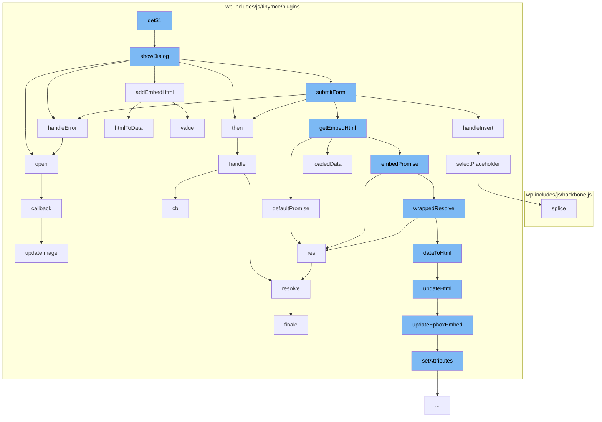

This document will cover the process of handling media in the TinyMCE editor, which includes:

1. Opening the media dialog
2. Handling media insertion
3. Handling media errors
4. Updating media attributes



<SwmSnippet path="/wp-includes/js/tinymce/plugins/media/plugin.js" line="854">

---

# Opening the media dialog

The function `showDialog` is used to open the media dialog. It sets up the dialog with fields for source, alternative source, poster, and embed. It also sets up event handlers for paste and change events on the source field, and a submit handler for the form.

```javascript
    var showDialog = function (editor) {
      var win;
      var data;
      var generalFormItems = [{
          name: 'source1',
          type: 'filepicker',
          filetype: 'media',
          size: 40,
          autofocus: true,
          label: 'Source',
          onpaste: function () {
            setTimeout(function () {
              Service.getEmbedHtml(editor, win.toJSON()).then(addEmbedHtml(win, editor)).catch(handleError(editor));
            }, 1);
          },
          onchange: function (e) {
            Service.getEmbedHtml(editor, win.toJSON()).then(addEmbedHtml(win, editor)).catch(handleError(editor));
            populateMeta(win, e.meta);
          },
          onbeforecall: function (e) {
            e.meta = win.toJSON();
```

---

</SwmSnippet>

<SwmSnippet path="/wp-includes/js/tinymce/plugins/media/plugin.js" line="832">

---

# Handling media insertion

The function `handleInsert` is used to handle the insertion of media into the editor. It first gets a list of all media objects in the editor before the insertion, then inserts the new media, and finally selects the newly inserted media.

```javascript
    var handleInsert = function (editor, html) {
      var beforeObjects = editor.dom.select('img[data-mce-object]');
      editor.insertContent(html);
      selectPlaceholder(editor, beforeObjects);
      editor.nodeChanged();
    };
```

---

</SwmSnippet>

<SwmSnippet path="/wp-includes/js/tinymce/plugins/media/plugin.js" line="779">

---

# Handling media errors

The function `handleError` is used to handle errors that occur during the media handling process. It displays an error notification with the error message.

```javascript
    var handleError = function (editor) {
      return function (error) {
        var errorMessage = error && error.msg ? 'Media embed handler error: ' + error.msg : 'Media embed handler threw unknown error.';
        editor.notificationManager.open({
          type: 'error',
          text: errorMessage
        });
      };
    };
```

---

</SwmSnippet>

<SwmSnippet path="/wp-includes/js/tinymce/plugins/media/plugin.js" line="304">

---

# Updating media attributes

The function `setAttributes` is used to update the attributes of a media object. It takes in the current attributes and the updated attributes, and updates the current attributes with the updated ones.

```javascript
    var setAttributes = function (attrs, updatedAttrs) {
      for (var name in updatedAttrs) {
        var value = '' + updatedAttrs[name];
        if (attrs.map[name]) {
          var i = attrs.length;
          while (i--) {
            var attr = attrs[i];
            if (attr.name === name) {
              if (value) {
                attrs.map[name] = value;
                attr.value = value;
              } else {
                delete attrs.map[name];
                attrs.splice(i, 1);
              }
            }
          }
        } else if (value) {
          attrs.push({
            name: name,
            value: value
```

---

</SwmSnippet>

&nbsp;

*This is an auto-generated document by Swimm AI 🌊 and has not yet been verified by a human*

<SwmMeta version="3.0.0" repo-id="Z2l0aHViJTNBJTNBbXl3ZWJzaXRlZGVtbyUzQSUzQWdpbGFkbmF2b3Q=" repo-name="mywebsitedemo" doc-type="flows"><sup>Powered by [Swimm](/)</sup></SwmMeta>
