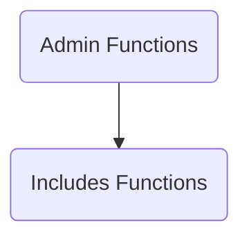

The mywebsitedemo repository is a <SwmToken path="/wp-admin/admin.php" pos="3:3:3" line-data=" * WordPress Administration Bootstrap">`WordPress`</SwmToken> project. It contains the codebase for a <SwmToken path="/wp-admin/admin.php" pos="3:3:3" line-data=" * WordPress Administration Bootstrap">`WordPress`</SwmToken> website, including various functionalities like site icons, multi-site management, emoji handling, URL details retrieval, and lyrics tag handling. It also includes the necessary REST API endpoints and <SwmToken path="/wp-includes/js/jquery/jquery.js" pos="165:1:1" line-data="	jquery: version,">`jquery`</SwmToken> scripts.

## Modules

### Admin Functions

Admin Functions in <SwmToken path="/wp-admin/admin.php" pos="3:3:3" line-data=" * WordPress Administration Bootstrap">`WordPress`</SwmToken> are a collection of scripts and styles that provide the functionality for the administrative area of a <SwmToken path="/wp-admin/admin.php" pos="3:3:3" line-data=" * WordPress Administration Bootstrap">`WordPress`</SwmToken> site. They include creating, editing, and deleting posts, pages, users, and other site content. They also include managing site settings, themes, plugins, and other aspects of site administration. The main files related to admin functions are located in the <SwmToken path="/wp-admin/admin.php" pos="62:22:24" line-data="	 * In single site, the user would be redirected to wp-admin/upgrade.php.">`wp-admin`</SwmToken> directory, such as <SwmPath>[wp-admin/admin.php](/wp-admin/admin.php)</SwmPath>, <SwmPath>[wp-admin/user/admin.php](/wp-admin/user/admin.php)</SwmPath>, and <SwmPath>[wp-admin/admin-functions.php](/wp-admin/admin-functions.php)</SwmPath>. These files include various functions and classes that handle different aspects of site administration. For example, <SwmPath>[wp-admin/admin.php](/wp-admin/admin.php)</SwmPath> is the main file that loads the <SwmToken path="/wp-admin/admin.php" pos="3:3:3" line-data=" * WordPress Administration Bootstrap">`WordPress`</SwmToken> environment and template, and <SwmPath>[wp-admin/admin-functions.php](/wp-admin/admin-functions.php)</SwmPath> is a deprecated file that was previously used to include all Administration functions. The admin functions also involve various CSS styles defined in the <SwmPath>[wp-admin/css/](/wp-admin/css/)</SwmPath> directory, such as those for the admin menu and buttons.

- <SwmLink doc-title="Basic Concepts of Admin Functions">[Basic Concepts of Admin Functions](/.swm/basic-concepts-of-admin-functions.costry5g.sw.md)</SwmLink>
- <SwmLink doc-title="Text Widgets Initialization and Rendering in WordPress">[Text Widgets Initialization and Rendering in WordPress](/.swm/text-widgets-initialization-and-rendering-in-wordpress.asa0l4eo.sw.md)</SwmLink>
- <SwmLink doc-title="Initialization of Existing Widget Containers">[Initialization of Existing Widget Containers](/.swm/initialization-of-existing-widget-containers.cpfixz3n.sw.md)</SwmLink>
- <SwmLink doc-title="The SwitchEditors Function Flow">[The SwitchEditors Function Flow](/.swm/the-switcheditors-function-flow.ldfoo2g4.sw.md)</SwmLink>
- <SwmLink doc-title="Text Widget Expansion Process in WordPress Admin">[Text Widget Expansion Process in WordPress Admin](/.swm/text-widget-expansion-process-in-wordpress-admin.aw2trl64.sw.md)</SwmLink>
- <SwmLink doc-title="Color Manipulation in WordPress Admin Interface">[Color Manipulation in WordPress Admin Interface](/.swm/color-manipulation-in-wordpress-admin-interface.i3di7x6f.sw.md)</SwmLink>
- <SwmLink doc-title="WP_List_Table Class Overview">[WP_List_Table Class Overview](/.swm/wp_list_table-class-overview.mwz7v.sw.md)</SwmLink>
- <SwmLink doc-title="WP_Upgrader_Skin Overview">[WP_Upgrader_Skin Overview](/.swm/wp_upgrader_skin-overview.bdya3.sw.md)</SwmLink>
- <SwmLink doc-title="WP_Upgrader Class Overview">[WP_Upgrader Class Overview](/.swm/wp_upgrader-class-overview.7n9ff.sw.md)</SwmLink>
- <SwmLink doc-title="WP_Filesystem_Base Overview">[WP_Filesystem_Base Overview](/.swm/wp_filesystem_base-overview.mowiq.sw.md)</SwmLink>
- <SwmLink doc-title="Overview of User Management">[Overview of User Management](/.swm/overview-of-user-management.l0qk4zny.sw.md)</SwmLink>
- <SwmLink doc-title="Basic Concepts of Plugin Management">[Basic Concepts of Plugin Management](/.swm/basic-concepts-of-plugin-management.995ctucj.sw.md)</SwmLink>
- <SwmLink doc-title="Introduction to Media Management">[Introduction to Media Management](/.swm/introduction-to-media-management.kmzf5iis.sw.md)</SwmLink>
- <SwmLink doc-title="Overview of Comment Management">[Overview of Comment Management](/.swm/overview-of-comment-management.neb04wnl.sw.md)</SwmLink>
- <SwmLink doc-title="Introduction to Post Management">[Introduction to Post Management](/.swm/introduction-to-post-management.j5s8lnmo.sw.md)</SwmLink>
- **Site Management**
  - <SwmLink doc-title="Overview of Site Management">[Overview of Site Management](/.swm/overview-of-site-management.hweracmu.sw.md)</SwmLink>
  - <SwmLink doc-title="Security and Access control in WordPress Multisite Networks">[Security and Access control in WordPress Multisite Networks](/.swm/security-and-access-control-in-wordpress-multisite-networks.ghsc2iyc.sw.md)</SwmLink>
- **Privacy Management**
  - <SwmLink doc-title="Understanding Privacy Management">[Understanding Privacy Management](/.swm/understanding-privacy-management.s8ffb9g9.sw.md)</SwmLink>
  - <SwmLink doc-title="Ensuring Data Security in Multisite Setups">[Ensuring Data Security in Multisite Setups](/.swm/ensuring-data-security-in-multisite-setups.61r0tpti.sw.md)</SwmLink>

### Includes Functions

The 'Includes Functions' are a crucial part of the <SwmToken path="/wp-admin/admin.php" pos="3:3:3" line-data=" * WordPress Administration Bootstrap">`WordPress`</SwmToken> codebase, providing a wide range of functionalities that are used throughout the system. They are designed to be reusable and modular, allowing developers to leverage these functions in different parts of the codebase to perform common tasks. This makes the code more maintainable and efficient.

- <SwmLink doc-title="Understanding Includes Functions">[Understanding Includes Functions](/.swm/understanding-includes-functions.juhv3vga.sw.md)</SwmLink>
- <SwmLink doc-title="Media Handling in TinyMCE">[Media Handling in TinyMCE](/.swm/media-handling-in-tinymce.d9w1k6m1.sw.md)</SwmLink>
- <SwmLink doc-title="Media Embedding in TinyMCE">[Media Embedding in TinyMCE](/.swm/media-embedding-in-tinymce.kkc5ywlh.sw.md)</SwmLink>
- <SwmLink doc-title="List Management in TinyMCE">[List Management in TinyMCE](/.swm/list-management-in-tinymce.xvt1rn4r.sw.md)</SwmLink>
- <SwmLink doc-title="Image Selection and Manipulation in WordPress">[Image Selection and Manipulation in WordPress](/.swm/image-selection-and-manipulation-in-wordpress.tej1w1k0.sw.md)</SwmLink>
- <SwmLink doc-title="Clipboard Handling in TinyMCE">[Clipboard Handling in TinyMCE](/.swm/clipboard-handling-in-tinymce.t6tq0jqb.sw.md)</SwmLink>
- <SwmLink doc-title="List Manipulations in TinyMCE">[List Manipulations in TinyMCE](/.swm/list-manipulations-in-tinymce.cvjtcnqd.sw.md)</SwmLink>
- <SwmLink doc-title="Image Area Selection Process">[Image Area Selection Process](/.swm/image-area-selection-process.fg9owcyd.sw.md)</SwmLink>
- <SwmLink doc-title="Image Selection Process in WordPress">[Image Selection Process in WordPress](/.swm/image-selection-process-in-wordpress.8ulggj3b.sw.md)</SwmLink>
- <SwmLink doc-title="Overview of the ParagonIE_Sodium_Core32_Util Class">[Overview of the ParagonIE_Sodium_Core32_Util Class](/.swm/overview-of-the-paragonie_sodium_core32_util-class.b9x6u.sw.md)</SwmLink>
- <SwmLink doc-title="WP_REST_Controller Overview">[WP_REST_Controller Overview](/.swm/wp_rest_controller-overview.e6j7h.sw.md)</SwmLink>
- <SwmLink doc-title="WP_Customize_Control Overview">[WP_Customize_Control Overview](/.swm/wp_customize_control-overview.wv58f.sw.md)</SwmLink>
- <SwmLink doc-title="WP_Widget Class Overview">[WP_Widget Class Overview](/.swm/wp_widget-class-overview.acm17.sw.md)</SwmLink>
- <SwmLink doc-title="getid3_handler Class Overview">[getid3_handler Class Overview](/.swm/getid3_handler-class-overview.nb62g.sw.md)</SwmLink>
- <SwmLink doc-title="Walker Class Overview">[Walker Class Overview](/.swm/walker-class-overview.ymlc9.sw.md)</SwmLink>
- <SwmLink doc-title="WP_Customize_Setting Overview">[WP_Customize_Setting Overview](/.swm/wp_customize_setting-overview.bx6rj.sw.md)</SwmLink>
- <SwmLink doc-title="WP_Customize_Section Overview">[WP_Customize_Section Overview](/.swm/wp_customize_section-overview.12o8r.sw.md)</SwmLink>
- <SwmLink doc-title="Overview of ParagonIE_Sodium_Core32_Util">[Overview of ParagonIE_Sodium_Core32_Util](/.swm/overview-of-paragonie_sodium_core32_util.nu1za.sw.md)</SwmLink>
- <SwmLink doc-title="Exception Class Overview">[Exception Class Overview](/.swm/exception-class-overview.yqef6.sw.md)</SwmLink>
- <SwmLink doc-title="SimplePie_Cache_Base Overview">[SimplePie_Cache_Base Overview](/.swm/simplepie_cache_base-overview.w6rtk.sw.md)</SwmLink>
- <SwmLink doc-title="Understanding WordPress Widgets">[Understanding WordPress Widgets](/.swm/understanding-wordpress-widgets.2zc9v59b.sw.md)</SwmLink>

### Content Plugins

Content plugins are located in the <SwmPath>[wp-content/plugins/](/wp-content/plugins/)</SwmPath> directory of the <SwmToken path="/wp-admin/admin.php" pos="3:3:3" line-data=" * WordPress Administration Bootstrap">`WordPress`</SwmToken> installation. They can provide a wide range of features and functionality enhancements. For example, the <SwmPath>[wp-content/plugins/hello.php](/wp-content/plugins/hello.php)</SwmPath> plugin displays a random lyric from the song 'Hello, Dolly' on the admin screen. The <SwmToken path="/wp-content/plugins/akismet/class.akismet.php" pos="3:2:2" line-data="class Akismet {">`Akismet`</SwmToken> plugin helps protect your blog from spam. Plugins can be activated or deactivated from the <SwmToken path="/wp-admin/admin.php" pos="3:3:3" line-data=" * WordPress Administration Bootstrap">`WordPress`</SwmToken> admin panel. When a plugin is activated, its code is included in the <SwmToken path="/wp-admin/admin.php" pos="3:3:3" line-data=" * WordPress Administration Bootstrap">`WordPress`</SwmToken> core, allowing it to affect the website's functionality. When it's deactivated, its code is no longer included, and it stops affecting the website.

- <SwmLink doc-title="Overview of Content Plugins">[Overview of Content Plugins](/.swm/overview-of-content-plugins.jnro6qv9.sw.md)</SwmLink>
- <SwmLink doc-title="Introduction to Akismet Plugin">[Introduction to Akismet Plugin](/.swm/introduction-to-akismet-plugin.kb4zup9n.sw.md)</SwmLink>
- <SwmLink doc-title="Exploring the Hello Dolly Plugin">[Exploring the Hello Dolly Plugin](/.swm/exploring-the-hello-dolly-plugin.p4yyb59y.sw.md)</SwmLink>

&nbsp;

*This is an auto-generated document by Swimm AI 🌊 and has not yet been verified by a human*

<SwmMeta version="3.0.0" repo-id="Z2l0aHViJTNBJTNBbXl3ZWJzaXRlZGVtbyUzQSUzQWdpbGFkbmF2b3Q=" repo-name="mywebsitedemo">Powered by [Swimm](https://app.swimm.io/)</SwmMeta>
