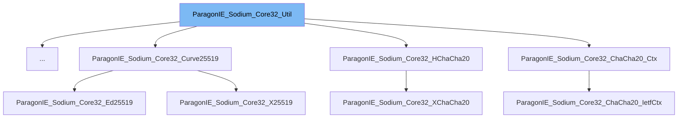

This document will cover the following aspects of the `ParagonIE_Sodium_Core32_Util` class:

1. What is `ParagonIE_Sodium_Core32_Util`.
2. Variables and functions of `ParagonIE_Sodium_Core32_Util`.
3. Usage example of `ParagonIE_Sodium_Core32_Util`.

# What is ParagonIE_Sodium_Core32_Util

`ParagonIE_Sodium_Core32_Util` is an abstract class in the WordPress project. It is part of the Sodium Compatibility library, which is a pure PHP polyfill for the Sodium cryptography library (a modern, easy-to-use software library for encryption, decryption, signatures, password hashing, and more). The `ParagonIE_Sodium_Core32_Util` class is extended by several other classes in the library, providing them with a set of utility methods.

# Variables and functions

The `ParagonIE_Sodium_Core32_Util` class does not define any variables or functions in its own scope. However, it extends the `ParagonIE_Sodium_Core_Util` class, which means it inherits all the public and protected methods and properties of the parent class. The actual functionality of `ParagonIE_Sodium_Core32_Util` is determined by the classes that extend it.

# Usage example

The `ParagonIE_Sodium_Core32_Util` class is used as a base class for several other classes in the Sodium Compatibility library. For example, the `ParagonIE_Sodium_Core32_Poly1305_State` class extends `ParagonIE_Sodium_Core32_Util`, inheriting its methods and properties. However, the specific usage of `ParagonIE_Sodium_Core32_Util` in `ParagonIE_Sodium_Core32_Poly1305_State` is not clear from the provided context.

&nbsp;

*This is an auto-generated document by Swimm AI 🌊 and has not yet been verified by a human*

<SwmMeta version="3.0.0" repo-id="Z2l0aHViJTNBJTNBbXl3ZWJzaXRlZGVtbyUzQSUzQWdpbGFkbmF2b3Q=" repo-name="mywebsitedemo" doc-type="class">Powered by [Swimm](/)</SwmMeta>
