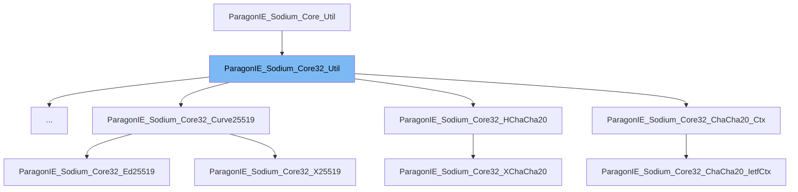

This document will cover the following aspects of the `ParagonIE_Sodium_Core32_Util` class:

1. What is `ParagonIE_Sodium_Core32_Util`.
2. Variables and functions of `ParagonIE_Sodium_Core32_Util`.
3. Usage example of `ParagonIE_Sodium_Core32_Util`.



# What is ParagonIE_Sodium_Core32_Util

`ParagonIE_Sodium_Core32_Util` is an abstract class in the WordPress project repository. It is part of the Sodium Compatibility library, which is a pure PHP polyfill for the Sodium cryptography library (a modern, easy-to-use software library for encryption, decryption, signatures, password hashing, and more). The `ParagonIE_Sodium_Core32_Util` class extends the `ParagonIE_Sodium_Core_Util` class, which provides utility functions for the Sodium Compatibility library.

# Variables and functions

The `ParagonIE_Sodium_Core32_Util` class does not define any specific variables or functions. However, it inherits all the variables and functions from the `ParagonIE_Sodium_Core_Util` class. The functions of the `ParagonIE_Sodium_Core_Util` class are used throughout the Sodium Compatibility library for various cryptographic operations.

<SwmSnippet path="/wp-includes/sodium_compat/src/Core32/Int64.php" line="96">

---

# Variables and functions

Here, the `declareScalarType` function of the `ParagonIE_Sodium_Core32_Util` class is used to ensure that the `$int` variable is of the 'int' type.

```hack
        ParagonIE_Sodium_Core32_Util::declareScalarType($int, 'int', 1);
```

---

</SwmSnippet>

<SwmSnippet path="/wp-includes/sodium_compat/src/Core32/SecretStream/State.php" line="59">

---

Here, the `store32_le` function of the `ParagonIE_Sodium_Core32_Util` class is used to convert the counter to a little-endian string.

```hack
        return ParagonIE_Sodium_Core32_Util::store32_le($this->counter);
```

---

</SwmSnippet>

# Usage example

`ParagonIE_Sodium_Core32_Util` is used in various parts of the Sodium Compatibility library. For instance, it is used in the `ParagonIE_Sodium_Core32_Poly1305_State` class.

<SwmSnippet path="/wp-includes/sodium_compat/src/Core32/Poly1305/State.php" line="10">

---

# Usage example

Here, the `ParagonIE_Sodium_Core32_Poly1305_State` class extends the `ParagonIE_Sodium_Core32_Util` class, inheriting all its functions.

```hack
class ParagonIE_Sodium_Core32_Poly1305_State extends ParagonIE_Sodium_Core32_Util
```

---

</SwmSnippet>

&nbsp;

*This is an auto-generated document by Swimm AI 🌊 and has not yet been verified by a human*

<SwmMeta version="3.0.0" repo-id="Z2l0aHViJTNBJTNBbXl3ZWJzaXRlZGVtbyUzQSUzQWdpbGFkbmF2b3Q=" repo-name="mywebsitedemo" doc-type="class"><sup>Powered by [Swimm](/)</sup></SwmMeta>
