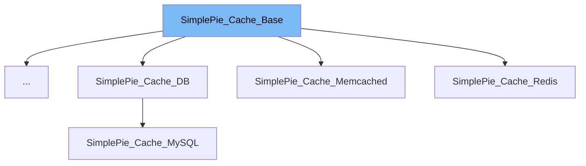

This document will cover the following aspects of the SimplePie_Cache_Base class:

1. What is SimplePie_Cache_Base
2. Variables and functions of SimplePie_Cache_Base
3. Usage example of SimplePie_Cache_Base



# What is SimplePie_Cache_Base

SimplePie_Cache_Base is an interface in the SimplePie library, which is a PHP-based RSS and Atom feed framework. It serves as the base for cache objects in the SimplePie library. Classes that are used with SimplePie_Cache::register() are expected to implement this interface.

<SwmSnippet path="/wp-includes/SimplePie/Cache/Base.php" line="60">

---

# Variables and functions

The constant `TYPE_FEED` is a string that represents the feed cache type.

```hack
	const TYPE_FEED = 'spc';
```

---

</SwmSnippet>

<SwmSnippet path="/wp-includes/SimplePie/Cache/Base.php" line="67">

---

The constant `TYPE_IMAGE` is a string that represents the image cache type.

```hack
	const TYPE_IMAGE = 'spi';
```

---

</SwmSnippet>

<SwmSnippet path="/wp-includes/SimplePie/Cache/Base.php" line="76">

---

The `__construct` function is used to create a new cache object. It takes three parameters: location, name, and type.

```hack
	public function __construct($location, $name, $type);
```

---

</SwmSnippet>

<SwmSnippet path="/wp-includes/SimplePie/Cache/Base.php" line="84">

---

The `save` function is used to save data to the cache. It takes an array or a SimplePie object as a parameter. If a SimplePie object is passed, only the data property is cached.

```hack
	public function save($data);
```

---

</SwmSnippet>

<SwmSnippet path="/wp-includes/SimplePie/Cache/Base.php" line="91">

---

The `load` function is used to retrieve the data saved to the cache.

```hack
	public function load();
```

---

</SwmSnippet>

<SwmSnippet path="/wp-includes/SimplePie/Cache/Base.php" line="98">

---

The `mtime` function is used to retrieve the last modified time for the cache.

```hack
	public function mtime();
```

---

</SwmSnippet>

<SwmSnippet path="/wp-includes/SimplePie/Cache/Base.php" line="105">

---

The `touch` function is used to set the last modified time to the current time.

```hack
	public function touch();
```

---

</SwmSnippet>

<SwmSnippet path="/wp-includes/SimplePie/Cache/Base.php" line="112">

---

The `unlink` function is used to remove the cache.

```hack
	public function unlink();
```

---

</SwmSnippet>

# Usage example

The SimplePie_Cache_Base interface is implemented by various classes in the SimplePie library. For instance, the SimplePie_Cache_Redis class implements this interface to provide caching functionality specific to Redis.

&nbsp;

*This is an auto-generated document by Swimm AI 🌊 and has not yet been verified by a human*

<SwmMeta version="3.0.0" repo-id="Z2l0aHViJTNBJTNBbXl3ZWJzaXRlZGVtbyUzQSUzQWdpbGFkbmF2b3Q=" repo-name="mywebsitedemo" doc-type="class"><sup>Powered by [Swimm](/)</sup></SwmMeta>
