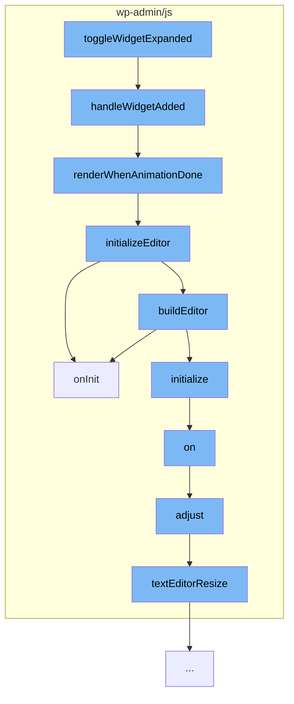

This document will cover the process of expanding a text widget in the WordPress admin interface. We'll cover:

1. The purpose of the `toggleWidgetExpanded` function
2. The sequence of function calls initiated by `toggleWidgetExpanded`
3. The role of each function in the sequence.



# The purpose of the `toggleWidgetExpanded` function

The `toggleWidgetExpanded` function is the entry point for expanding a text widget in the WordPress admin interface. It's responsible for initiating a sequence of function calls that handle the widget expansion process.

<SwmSnippet path="/wp-admin/js/widgets/text-widgets.js" line="372">

---

# The sequence of function calls initiated by `toggleWidgetExpanded`

The `handleWidgetAdded` function is called by `toggleWidgetExpanded`. It's responsible for setting up the widget for the first time when it's added. It checks if the widget is already initialized, if it's in legacy mode, and then sets up the widget control fields.

```javascript
	/**
	 * Handle widget being added or initialized for the first time at the widget-added event.
	 *
	 * @memberOf wp.textWidgets
	 *
	 * @param {jQuery.Event} event - Event.
	 * @param {jQuery}       widgetContainer - Widget container element.
	 *
	 * @return {void}
	 */
	component.handleWidgetAdded = function handleWidgetAdded( event, widgetContainer ) {
		var widgetForm, idBase, widgetControl, widgetId, animatedCheckDelay = 50, renderWhenAnimationDone, fieldContainer, syncContainer;
		widgetForm = widgetContainer.find( '> .widget-inside > .form, > .widget-inside > form' ); // Note: '.form' appears in the customizer, whereas 'form' on the widgets admin screen.

		idBase = widgetForm.find( '> .id_base' ).val();
		if ( -1 === component.idBases.indexOf( idBase ) ) {
			return;
		}

		// Prevent initializing already-added widgets.
		widgetId = widgetForm.find( '.widget-id' ).val();
```

---

</SwmSnippet>

<SwmSnippet path="/wp-admin/js/widgets/text-widgets.js" line="424">

---

`handleWidgetAdded` then calls `renderWhenAnimationDone`, which waits for the widget container's animation to finish before initializing the editor.

```javascript
		/*
		 * Render the widget once the widget parent's container finishes animating,
		 * as the widget-added event fires with a slideDown of the container.
		 * This ensures that the textarea is visible and an iframe can be embedded
		 * with TinyMCE being able to set contenteditable on it.
		 */
		renderWhenAnimationDone = function() {
			if ( ! widgetContainer.hasClass( 'open' ) ) {
				setTimeout( renderWhenAnimationDone, animatedCheckDelay );
			} else {
				widgetControl.initializeEditor();
			}
		};
```

---

</SwmSnippet>

<SwmSnippet path="/wp-admin/js/widgets/text-widgets.js" line="173">

---

`renderWhenAnimationDone` calls `initializeEditor`, which sets up the text editor for the widget. It binds various events and initializes the TinyMCE editor.

```javascript
		initializeEditor: function initializeEditor() {
			var control = this, changeDebounceDelay = 1000, id, textarea, triggerChangeIfDirty, restoreTextMode = false, needsTextareaChangeTrigger = false, previousValue;
			textarea = control.fields.text;
			id = textarea.attr( 'id' );
			previousValue = textarea.val();

			/**
			 * Trigger change if dirty.
			 *
			 * @return {void}
			 */
			triggerChangeIfDirty = function() {
				var updateWidgetBuffer = 300; // See wp.customize.Widgets.WidgetControl._setupUpdateUI() which uses 250ms for updateWidgetDebounced.
				if ( control.editor.isDirty() ) {

					/*
					 * Account for race condition in customizer where user clicks Save & Publish while
					 * focus was just previously given to the editor. Since updates to the editor
					 * are debounced at 1 second and since widget input changes are only synced to
					 * settings after 250ms, the customizer needs to be put into the processing
					 * state during the time between the change event is triggered and updateWidget
```

---

</SwmSnippet>

<SwmSnippet path="/wp-admin/js/widgets/text-widgets.js" line="291">

---

`initializeEditor` calls `onInit`, which handles events related to the TinyMCE editor, such as rebuilding the editor when the widget is moved in the DOM, and showing pointers when switching tabs or pasting HTML.

```javascript
				onInit = function() {

					// When a widget is moved in the DOM the dynamically-created TinyMCE iframe will be destroyed and has to be re-built.
					$( editor.getWin() ).on( 'pagehide', function() {
						_.defer( buildEditor );
					});

					// If a prior mce instance was replaced, and it was in text mode, toggle to text mode.
					if ( restoreTextMode ) {
						switchEditors.go( id, 'html' );
					}

					// Show the pointer.
					$( '#' + id + '-html' ).on( 'click', function() {
						control.pasteHtmlPointer.hide(); // Hide the HTML pasting pointer.

						if ( -1 !== component.dismissedPointers.indexOf( 'text_widget_custom_html' ) ) {
							return;
						}
						showPointerElement( control.customHtmlWidgetPointer );
					});
```

---

</SwmSnippet>

<SwmSnippet path="/wp-admin/js/editor-expand.js" line="810">

---

`initializeEditor` also calls `on` from `editor-expand.js`, which binds editor expand events on elements, adjusting the editor when the window is scrolled or resized.

```javascript
		/**
		 * Binds editor expand events on elements.
		 *
		 * @since 4.0.0
		 *
		 * @return {void}
		 */
		function on() {
			/*
			 * Scroll to the top when triggering this from JS.
			 * Ensure the toolbars are pinned properly.
			 */
			if ( window.pageYOffset && window.pageYOffset > pageYOffsetAtTop ) {
				window.scrollTo( window.pageXOffset, 0 );
			}

			$wrap.addClass( 'wp-editor-expand' );

			// Adjust when the window is scrolled or resized.
			$window.on( 'scroll.editor-expand resize.editor-expand', function( event ) {
				adjust( event.type );
```

---

</SwmSnippet>

<SwmSnippet path="/wp-admin/js/editor-expand.js" line="453">

---

`on` then calls `adjust`, which adjusts the toolbars heights and positions based on the scroll position on the page, the active editor mode, and the heights of the editor, admin bar, and side bar.

```javascript
		/**
		 * Adjusts the toolbars heights and positions.
		 *
		 * Adjusts the toolbars heights and positions based on the scroll position on
		 * the page, the active editor mode and the heights of the editor, admin bar and
		 * side bar.
		 *
		 * @since 4.0.0
		 *
		 * @param {event} event The event that calls this function.
		 *
		 * @return {void}
		 */
		function adjust( event ) {

			// Makes sure we're not in fullscreen mode.
			if ( fullscreen && fullscreen.settings.visible ) {
				return;
			}

			var windowPos = $window.scrollTop(),
```

---

</SwmSnippet>

<SwmSnippet path="/wp-admin/js/editor-expand.js" line="95">

---

Finally, `adjust` calls `textEditorResize`, which resizes the text editor depending on the old text length.

```javascript
		/**
		 * Resizes the text editor depending on the old text length.
		 *
		 * If there is an mceEditor and it is hidden, it resizes the editor depending
		 * on the old text length. If the current length of the text is smaller than
		 * the old text length, it shrinks the text area. Otherwise it resizes the editor to
		 * the scroll height.
		 *
		 * @since 4.6.1
		 *
		 * @return {void}
		 */
		function textEditorResize() {
			var length = textEditor.value.length;

			if ( mceEditor && ! mceEditor.isHidden() ) {
				return;
			}

			if ( ! mceEditor && initialMode === 'tinymce' ) {
				return;
```

---

</SwmSnippet>

&nbsp;

*This is an auto-generated document by Swimm AI 🌊 and has not yet been verified by a human*

<SwmMeta version="3.0.0" repo-id="Z2l0aHViJTNBJTNBbXl3ZWJzaXRlZGVtbyUzQSUzQWdpbGFkbmF2b3Q=" repo-name="mywebsitedemo" doc-type="flows"><sup>Powered by [Swimm](/)</sup></SwmMeta>
