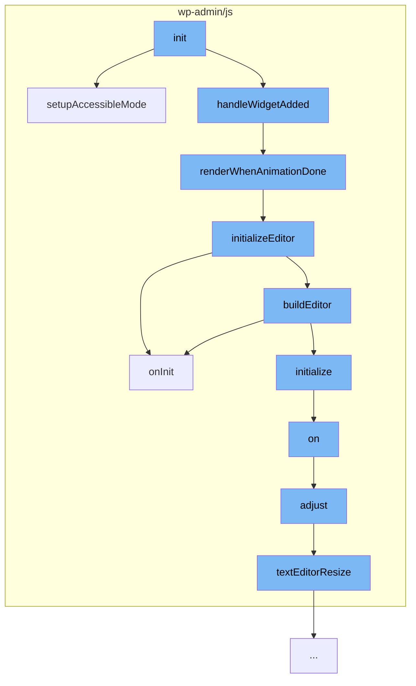

This document will cover the process of initializing and rendering text widgets in WordPress, which includes:

1. Setting up the widget in accessibility mode
2. Rendering the widget once the widget parent's container finishes animating
3. Initializing the editor
4. Adjusting the editor's height and position based on the scroll position on the page.



<SwmSnippet path="/wp-admin/js/widgets/text-widgets.js" line="440">

---

# Setting up the widget in accessibility mode

The function `setupAccessibleMode` is used to set up the widget in accessibility mode. It checks if the widget form exists and if it's in legacy mode. If not, it creates a new TextWidgetControl and initializes the editor.

```javascript
	/**
	 * Setup widget in accessibility mode.
	 *
	 * @memberOf wp.textWidgets
	 *
	 * @return {void}
	 */
	component.setupAccessibleMode = function setupAccessibleMode() {
		var widgetForm, idBase, widgetControl, fieldContainer, syncContainer;
		widgetForm = $( '.editwidget > form' );
		if ( 0 === widgetForm.length ) {
			return;
		}

		idBase = widgetForm.find( '.id_base' ).val();
		if ( -1 === component.idBases.indexOf( idBase ) ) {
			return;
		}

		// Bypass using TinyMCE when widget is in legacy mode.
		if ( ! widgetForm.find( '.visual' ).val() ) {
```

---

</SwmSnippet>

<SwmSnippet path="/wp-admin/js/widgets/text-widgets.js" line="424">

---

# Rendering the widget once the widget parent's container finishes animating

The function `renderWhenAnimationDone` is used to render the widget once the widget parent's container finishes animating. It checks if the widget container is open, if not, it waits and tries again. Once the container is open, it initializes the editor.

```javascript
		/*
		 * Render the widget once the widget parent's container finishes animating,
		 * as the widget-added event fires with a slideDown of the container.
		 * This ensures that the textarea is visible and an iframe can be embedded
		 * with TinyMCE being able to set contenteditable on it.
		 */
		renderWhenAnimationDone = function() {
			if ( ! widgetContainer.hasClass( 'open' ) ) {
				setTimeout( renderWhenAnimationDone, animatedCheckDelay );
			} else {
				widgetControl.initializeEditor();
			}
		};
```

---

</SwmSnippet>

<SwmSnippet path="/wp-admin/js/widgets/text-widgets.js" line="173">

---

# Initializing the editor

The function `initializeEditor` is used to initialize the editor. It sets up the editor's settings, binds events, and builds the editor.

```javascript
		initializeEditor: function initializeEditor() {
			var control = this, changeDebounceDelay = 1000, id, textarea, triggerChangeIfDirty, restoreTextMode = false, needsTextareaChangeTrigger = false, previousValue;
			textarea = control.fields.text;
			id = textarea.attr( 'id' );
			previousValue = textarea.val();

			/**
			 * Trigger change if dirty.
			 *
			 * @return {void}
			 */
			triggerChangeIfDirty = function() {
				var updateWidgetBuffer = 300; // See wp.customize.Widgets.WidgetControl._setupUpdateUI() which uses 250ms for updateWidgetDebounced.
				if ( control.editor.isDirty() ) {

					/*
					 * Account for race condition in customizer where user clicks Save & Publish while
					 * focus was just previously given to the editor. Since updates to the editor
					 * are debounced at 1 second and since widget input changes are only synced to
					 * settings after 250ms, the customizer needs to be put into the processing
					 * state during the time between the change event is triggered and updateWidget
```

---

</SwmSnippet>

<SwmSnippet path="/wp-admin/js/editor-expand.js" line="453">

---

# Adjusting the editor's height and position based on the scroll position on the page

The function `adjust` is used to adjust the editor's height and position based on the scroll position on the page. It checks if the editor is in fullscreen mode, if not, it adjusts the toolbars heights and positions based on the scroll position on the page, the active editor mode and the heights of the editor, admin bar and side bar.

```javascript
		/**
		 * Adjusts the toolbars heights and positions.
		 *
		 * Adjusts the toolbars heights and positions based on the scroll position on
		 * the page, the active editor mode and the heights of the editor, admin bar and
		 * side bar.
		 *
		 * @since 4.0.0
		 *
		 * @param {event} event The event that calls this function.
		 *
		 * @return {void}
		 */
		function adjust( event ) {

			// Makes sure we're not in fullscreen mode.
			if ( fullscreen && fullscreen.settings.visible ) {
				return;
			}

			var windowPos = $window.scrollTop(),
```

---

</SwmSnippet>

&nbsp;

*This is an auto-generated document by Swimm AI 🌊 and has not yet been verified by a human*

<SwmMeta version="3.0.0" repo-id="Z2l0aHViJTNBJTNBbXl3ZWJzaXRlZGVtbyUzQSUzQWdpbGFkbmF2b3Q=" repo-name="mywebsitedemo" doc-type="flows"><sup>Powered by [Swimm](/)</sup></SwmMeta>
