This document will cover the process of the <SwmToken path="/wp-admin/js/editor.js" pos="15:3:3" line-data="	function SwitchEditors() {">`SwitchEditors`</SwmToken> function in the <SwmToken path="/wp-includes/js/quicktags.js" pos="5:15:15" line-data=" * This is the HTML editor in WordPress. It can be attached to any textarea and will">`WordPress`</SwmToken> project, which includes:

1. The purpose of the <SwmToken path="/wp-admin/js/editor.js" pos="15:3:3" line-data="	function SwitchEditors() {">`SwitchEditors`</SwmToken> function
2. The flow of function calls initiated by <SwmToken path="/wp-admin/js/editor.js" pos="15:3:3" line-data="	function SwitchEditors() {">`SwitchEditors`</SwmToken>
3. The role of each function in the flow.

```mermaid
graph TD;
subgraph wp-includes/js
  SwitchEditors:::mainFlowStyle --> closeAllTags
end
subgraph wp-admin/js
  SwitchEditors:::mainFlowStyle --> findBookmarkedPosition
end
subgraph wp-admin/js
  SwitchEditors:::mainFlowStyle --> init
end
subgraph wp-admin/js
  SwitchEditors:::mainFlowStyle --> addHTMLBookmarkInTextAreaContent
end
subgraph wp-admin/js
  SwitchEditors:::mainFlowStyle --> switchEditor
end
subgraph wp-includes/js
  closeAllTags --> _close
end
subgraph wp-includes/js
  _close --> closeTag
end
subgraph wp-admin/js
  findBookmarkedPosition --> on
end
subgraph wp-admin/js
  on --> adjust
end
subgraph wp-admin/js
  init --> on
end
subgraph wp-admin/js
  addHTMLBookmarkInTextAreaContent --> adjustTextAreaSelectionCursors
end
subgraph wp-admin/js
  adjustTextAreaSelectionCursors --> getShortcodeWrapperInfo
end
subgraph wp-includes/js
  switchEditor:::mainFlowStyle --> closeAllTags
end
subgraph wp-admin/js
  switchEditor:::mainFlowStyle --> findBookmarkedPosition
end
subgraph wp-admin/js
  switchEditor:::mainFlowStyle --> init
end
subgraph wp-admin/js
  switchEditor:::mainFlowStyle --> addHTMLBookmarkInTextAreaContent
end
subgraph wp-admin/js
  switchEditor:::mainFlowStyle --> focusHTMLBookmarkInVisualEditor
end
subgraph wp-admin/js
  focusHTMLBookmarkInVisualEditor:::mainFlowStyle --> scrollVisualModeToStartElement
end
subgraph wp-includes/js
  scrollVisualModeToStartElement:::mainFlowStyle --> animate
end
subgraph wp-includes/js
  animate:::mainFlowStyle --> requestAnimationFrame
end
subgraph wp-includes/js
  requestAnimationFrame:::mainFlowStyle --> max
end
subgraph wp-includes/js
  max:::mainFlowStyle --> each
end
subgraph wp-includes/js
  max:::mainFlowStyle --> cb
end
subgraph wp-includes/js
  cb:::mainFlowStyle --> iteratee
end
subgraph wp-includes/js
  iteratee:::mainFlowStyle --> baseIteratee
end
  baseIteratee:::mainFlowStyle --> ...

 classDef mainFlowStyle color:#000000,fill:#7CB9F4
  classDef rootsStyle color:#000000,fill:#00FFF4

%% Swimm:
%% graph TD;
%% subgraph <SwmPath>[wp-includes/js/](/wp-includes/js/)</SwmPath>
%%   SwitchEditors:::mainFlowStyle --> <SwmToken path="/wp-includes/js/quicktags.js" pos="616:3:3" line-data="	qt.closeAllTags = function( editor_id ) {">`closeAllTags`</SwmToken>
%% end
%% subgraph <SwmPath>[wp-admin/js/](/wp-admin/js/)</SwmPath>
%%   SwitchEditors:::mainFlowStyle --> <SwmToken path="/wp-admin/js/editor.js" pos="172:5:5" line-data="						selectionRange = findBookmarkedPosition( editor );">`findBookmarkedPosition`</SwmToken>
%% end
%% subgraph <SwmPath>[wp-admin/js/](/wp-admin/js/)</SwmPath>
%%   SwitchEditors:::mainFlowStyle --> init
%% end
%% subgraph <SwmPath>[wp-admin/js/](/wp-admin/js/)</SwmPath>
%%   SwitchEditors:::mainFlowStyle --> <SwmToken path="/wp-admin/js/editor.js" pos="116:1:1" line-data="					addHTMLBookmarkInTextAreaContent( $textarea );">`addHTMLBookmarkInTextAreaContent`</SwmToken>
%% end
%% subgraph <SwmPath>[wp-admin/js/](/wp-admin/js/)</SwmPath>
%%   SwitchEditors:::mainFlowStyle --> <SwmToken path="/wp-admin/js/editor.js" pos="38:1:1" line-data="						switchEditor( id, mode );">`switchEditor`</SwmToken>
%% end
%% subgraph <SwmPath>[wp-includes/js/](/wp-includes/js/)</SwmPath>
%%   <SwmToken path="/wp-includes/js/quicktags.js" pos="616:3:3" line-data="	qt.closeAllTags = function( editor_id ) {">`closeAllTags`</SwmToken> --> _close
%% end
%% subgraph <SwmPath>[wp-includes/js/](/wp-includes/js/)</SwmPath>
%%   _close --> <SwmToken path="/wp-includes/js/quicktags.js" pos="475:7:7" line-data="	qt.TagButton.prototype.closeTag = function( element, ed ) {">`closeTag`</SwmToken>
%% end
%% subgraph <SwmPath>[wp-admin/js/](/wp-admin/js/)</SwmPath>
%%   <SwmToken path="/wp-admin/js/editor.js" pos="172:5:5" line-data="						selectionRange = findBookmarkedPosition( editor );">`findBookmarkedPosition`</SwmToken> --> on
%% end
%% subgraph <SwmPath>[wp-admin/js/](/wp-admin/js/)</SwmPath>
%%   on --> adjust
%% end
%% subgraph <SwmPath>[wp-admin/js/](/wp-admin/js/)</SwmPath>
%%   init --> on
%% end
%% subgraph <SwmPath>[wp-admin/js/](/wp-admin/js/)</SwmPath>
%%   <SwmToken path="/wp-admin/js/editor.js" pos="116:1:1" line-data="					addHTMLBookmarkInTextAreaContent( $textarea );">`addHTMLBookmarkInTextAreaContent`</SwmToken> --> <SwmToken path="/wp-admin/js/editor.js" pos="400:3:3" line-data="		function adjustTextAreaSelectionCursors( content, cursorPositions ) {">`adjustTextAreaSelectionCursors`</SwmToken>
%% end
%% subgraph <SwmPath>[wp-admin/js/](/wp-admin/js/)</SwmPath>
%%   <SwmToken path="/wp-admin/js/editor.js" pos="400:3:3" line-data="		function adjustTextAreaSelectionCursors( content, cursorPositions ) {">`adjustTextAreaSelectionCursors`</SwmToken> --> <SwmToken path="/wp-admin/js/editor.js" pos="393:6:6" line-data="		 * @link getShortcodeWrapperInfo">`getShortcodeWrapperInfo`</SwmToken>
%% end
%% subgraph <SwmPath>[wp-includes/js/](/wp-includes/js/)</SwmPath>
%%   switchEditor:::mainFlowStyle --> <SwmToken path="/wp-includes/js/quicktags.js" pos="616:3:3" line-data="	qt.closeAllTags = function( editor_id ) {">`closeAllTags`</SwmToken>
%% end
%% subgraph <SwmPath>[wp-admin/js/](/wp-admin/js/)</SwmPath>
%%   switchEditor:::mainFlowStyle --> <SwmToken path="/wp-admin/js/editor.js" pos="172:5:5" line-data="						selectionRange = findBookmarkedPosition( editor );">`findBookmarkedPosition`</SwmToken>
%% end
%% subgraph <SwmPath>[wp-admin/js/](/wp-admin/js/)</SwmPath>
%%   switchEditor:::mainFlowStyle --> init
%% end
%% subgraph <SwmPath>[wp-admin/js/](/wp-admin/js/)</SwmPath>
%%   switchEditor:::mainFlowStyle --> <SwmToken path="/wp-admin/js/editor.js" pos="116:1:1" line-data="					addHTMLBookmarkInTextAreaContent( $textarea );">`addHTMLBookmarkInTextAreaContent`</SwmToken>
%% end
%% subgraph <SwmPath>[wp-admin/js/](/wp-admin/js/)</SwmPath>
%%   switchEditor:::mainFlowStyle --> <SwmToken path="/wp-admin/js/editor.js" pos="581:4:4" line-data="		 * `focusHTMLBookmarkInVisualEditor()` and scrolls the screen so the element appears roughly">`focusHTMLBookmarkInVisualEditor`</SwmToken>
%% end
%% subgraph <SwmPath>[wp-admin/js/](/wp-admin/js/)</SwmPath>
%%   focusHTMLBookmarkInVisualEditor:::mainFlowStyle --> <SwmToken path="/wp-admin/js/editor.js" pos="590:3:3" line-data="		function scrollVisualModeToStartElement( editor, element ) {">`scrollVisualModeToStartElement`</SwmToken>
%% end
%% subgraph <SwmPath>[wp-includes/js/](/wp-includes/js/)</SwmPath>
%%   scrollVisualModeToStartElement:::mainFlowStyle --> animate
%% end
%% subgraph <SwmPath>[wp-includes/js/](/wp-includes/js/)</SwmPath>
%%   animate:::mainFlowStyle --> <SwmToken path="/wp-includes/js/mediaelement/mediaelement.js" pos="3440:5:5" line-data="	_window2.default.requestAnimationFrame(function animate(timestamp) {">`requestAnimationFrame`</SwmToken>
%% end
%% subgraph <SwmPath>[wp-includes/js/](/wp-includes/js/)</SwmPath>
%%   requestAnimationFrame:::mainFlowStyle --> max
%% end
%% subgraph <SwmPath>[wp-includes/js/](/wp-includes/js/)</SwmPath>
%%   max:::mainFlowStyle --> each
%% end
%% subgraph <SwmPath>[wp-includes/js/](/wp-includes/js/)</SwmPath>
%%   max:::mainFlowStyle --> cb
%% end
%% subgraph <SwmPath>[wp-includes/js/](/wp-includes/js/)</SwmPath>
%%   cb:::mainFlowStyle --> iteratee
%% end
%% subgraph <SwmPath>[wp-includes/js/](/wp-includes/js/)</SwmPath>
%%   iteratee:::mainFlowStyle --> <SwmToken path="/wp-includes/js/underscore.js" pos="737:3:3" line-data="  function baseIteratee(value, context, argCount) {">`baseIteratee`</SwmToken>
%% end
%%   baseIteratee:::mainFlowStyle --> ...
%% 
%%  classDef mainFlowStyle color:#000000,fill:#7CB9F4
%%   classDef rootsStyle color:#000000,fill:#00FFF4
```



# The Purpose of the <SwmToken path="/wp-admin/js/editor.js" pos="15:3:3" line-data="	function SwitchEditors() {">`SwitchEditors`</SwmToken> Function

The <SwmToken path="/wp-admin/js/editor.js" pos="15:3:3" line-data="	function SwitchEditors() {">`SwitchEditors`</SwmToken> function in <SwmPath>[wp-admin/js/editor.js](/wp-admin/js/editor.js)</SwmPath> is a key part of the <SwmToken path="/wp-includes/js/quicktags.js" pos="5:15:15" line-data=" * This is the HTML editor in WordPress. It can be attached to any textarea and will">`WordPress`</SwmToken> editor's functionality. It is responsible for switching between the visual and text editing modes in the <SwmToken path="/wp-includes/js/quicktags.js" pos="5:15:15" line-data=" * This is the HTML editor in WordPress. It can be attached to any textarea and will">`WordPress`</SwmToken> editor. This function initiates a series of function calls to ensure a smooth transition between the two modes.

# The Flow of Function Calls Initiated by <SwmToken path="/wp-admin/js/editor.js" pos="15:3:3" line-data="	function SwitchEditors() {">`SwitchEditors`</SwmToken>

When <SwmToken path="/wp-admin/js/editor.js" pos="15:3:3" line-data="	function SwitchEditors() {">`SwitchEditors`</SwmToken> is called, it initiates a series of function calls to other functions within the <SwmToken path="/wp-includes/js/quicktags.js" pos="5:15:15" line-data=" * This is the HTML editor in WordPress. It can be attached to any textarea and will">`WordPress`</SwmToken> codebase. These include <SwmToken path="/wp-includes/js/quicktags.js" pos="616:3:3" line-data="	qt.closeAllTags = function( editor_id ) {">`closeAllTags`</SwmToken>, <SwmToken path="/wp-admin/js/editor.js" pos="172:5:5" line-data="						selectionRange = findBookmarkedPosition( editor );">`findBookmarkedPosition`</SwmToken>, <SwmToken path="/wp-content/plugins/akismet/class.akismet.php" pos="22:7:7" line-data="	public static function init() {">`init`</SwmToken>, <SwmToken path="/wp-admin/js/editor.js" pos="116:1:1" line-data="					addHTMLBookmarkInTextAreaContent( $textarea );">`addHTMLBookmarkInTextAreaContent`</SwmToken>, and <SwmToken path="/wp-admin/js/editor.js" pos="38:1:1" line-data="						switchEditor( id, mode );">`switchEditor`</SwmToken>. Each of these functions plays a specific role in the process of switching between the visual and text editing modes.

<SwmSnippet path="/wp-includes/js/quicktags.js" line="616">

---

# The Role of Each Function in the Flow

<SwmToken path="/wp-includes/js/quicktags.js" pos="616:3:3" line-data="	qt.closeAllTags = function( editor_id ) {">`closeAllTags`</SwmToken> is a function that closes all open HTML tags in the text editor. This is necessary to ensure that the HTML code in the text editor is well-formed when switching to the visual editor.

```javascript
	qt.closeAllTags = function( editor_id ) {
		var ed = this.getInstance( editor_id );

		if ( ed ) {
			qt._close( '', ed.canvas, ed );
		}
	};
```

---

</SwmSnippet>

<SwmSnippet path="/wp-admin/js/editor.js" line="577">

---

<SwmToken path="/wp-admin/js/editor.js" pos="590:3:3" line-data="		function scrollVisualModeToStartElement( editor, element ) {">`scrollVisualModeToStartElement`</SwmToken> is a function that scrolls the visual editor to the start element. This ensures that the same part of the content is visible when switching between the two modes.

```javascript
		/**
		 * Scrolls the content to place the selected element in the center of the screen.
		 *
		 * Takes an element, that is usually the selection start element, selected in
		 * `focusHTMLBookmarkInVisualEditor()` and scrolls the screen so the element appears roughly
		 * in the middle of the screen.
		 *
		 * I order to achieve the proper positioning, the editor media bar and toolbar are subtracted
		 * from the window height, to get the proper viewport window, that the user sees.
		 *
		 * @param {Object} editor TinyMCE editor instance.
		 * @param {Object} element HTMLElement that should be scrolled into view.
		 */
		function scrollVisualModeToStartElement( editor, element ) {
			var elementTop = editor.$( element ).offset().top,
				TinyMCEContentAreaTop = editor.$( editor.getContentAreaContainer() ).offset().top,

				toolbarHeight = getToolbarHeight( editor ),

				edTools = $( '#wp-content-editor-tools' ),
				edToolsHeight = 0,
```

---

</SwmSnippet>

<SwmSnippet path="/wp-includes/js/mediaelement/mediaelement.js" line="3440">

---

<SwmToken path="/wp-includes/js/mediaelement/mediaelement.js" pos="3440:9:9" line-data="	_window2.default.requestAnimationFrame(function animate(timestamp) {">`animate`</SwmToken> is a function that provides a smooth scrolling animation when switching between the two modes.

```javascript
	_window2.default.requestAnimationFrame(function animate(timestamp) {
		start = start || timestamp;
		var progress = timestamp - start;
		var opacity = parseFloat(1 - progress / duration, 2);
		el.style.opacity = opacity < 0 ? 0 : opacity;
		if (progress > duration) {
			if (callback && typeof callback === 'function') {
				callback();
			}
		} else {
			_window2.default.requestAnimationFrame(animate);
		}
```

---

</SwmSnippet>

<SwmSnippet path="/wp-admin/js/editor.js" line="386">

---

<SwmToken path="/wp-admin/js/editor.js" pos="400:3:3" line-data="		function adjustTextAreaSelectionCursors( content, cursorPositions ) {">`adjustTextAreaSelectionCursors`</SwmToken> is a function that adjusts the text area selection cursors according to HTML tags, comments, and shortcodes. This ensures that the selection in the text editor matches the selection in the visual editor.

```javascript
		/**
		 * Gets adjusted selection cursor positions according to HTML tags, comments, and shortcodes.
		 *
		 * Shortcodes and HTML codes are a bit of a special case when selecting, since they may render
		 * content in Visual mode. If we insert selection markers somewhere inside them, it's really possible
		 * to break the syntax and render the HTML tag or shortcode broken.
		 *
		 * @link getShortcodeWrapperInfo
		 *
		 * @param {string} content Textarea content that the cursors are in
		 * @param {{cursorStart: number, cursorEnd: number}} cursorPositions Cursor start and end positions
		 *
		 * @return {{cursorStart: number, cursorEnd: number}}
		 */
		function adjustTextAreaSelectionCursors( content, cursorPositions ) {
			var voidElements = [
				'area', 'base', 'br', 'col', 'embed', 'hr', 'img', 'input',
				'keygen', 'link', 'meta', 'param', 'source', 'track', 'wbr'
			];

			var cursorStart = cursorPositions.cursorStart,
```

---

</SwmSnippet>

&nbsp;

*This is an auto-generated document by Swimm AI 🌊 and has not yet been verified by a human*

<SwmMeta version="3.0.0" repo-id="Z2l0aHViJTNBJTNBbXl3ZWJzaXRlZGVtbyUzQSUzQWdpbGFkbmF2b3Q=" repo-name="mywebsitedemo"><sup>Powered by [Swimm](https://app.swimm.io/)</sup></SwmMeta>
