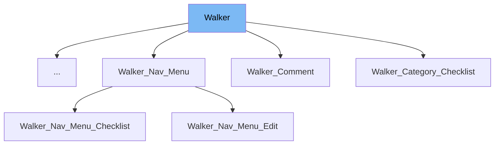

This document will cover the following aspects of the Walker class in the WordPress project:

1. What is Walker
2. Variables and functions in Walker
3. Usage example of Walker



# What is Walker

The Walker class is a part of the WordPress core, located in the wp-includes directory. It is designed to traverse and display elements which have a hierarchical (or tree like) structure. It abstracts the process of traversing elements, and provides methods that child classes can use to provide specific HTML output. The Walker class is typically extended by other classes to generate specific types of HTML such as menus, lists and dropdowns.

<SwmSnippet path="/wp-includes/class-wp-walker.php" line="22">

---

# Variables and functions

The `tree_type` variable is used to specify what type of elements the Walker class is handling.

```hack
	public $tree_type;
```

---

</SwmSnippet>

<SwmSnippet path="/wp-includes/class-wp-walker.php" line="30">

---

The `db_fields` variable is an array that holds the database fields to use.

```hack
	public $db_fields;
```

---

</SwmSnippet>

<SwmSnippet path="/wp-includes/class-wp-walker.php" line="38">

---

The `max_pages` variable is used to specify the maximum number of pages walked by the paged walker.

```hack
	public $max_pages = 1;
```

---

</SwmSnippet>

<SwmSnippet path="/wp-includes/class-wp-walker.php" line="48">

---

The `has_children` variable is a boolean value that indicates whether the current element has children or not.

```hack
	public $has_children;
```

---

</SwmSnippet>

<SwmSnippet path="/wp-includes/class-wp-walker.php" line="63">

---

The `start_lvl` function is an abstract function that starts the list before the elements are added.

```hack
	public function start_lvl( &$output, $depth = 0, $args = array() ) {}
```

---

</SwmSnippet>

<SwmSnippet path="/wp-includes/class-wp-walker.php" line="78">

---

The `end_lvl` function is an abstract function that ends the list after the elements are added.

```hack
	public function end_lvl( &$output, $depth = 0, $args = array() ) {}
```

---

</SwmSnippet>

<SwmSnippet path="/wp-includes/class-wp-walker.php" line="96">

---

The `start_el` function is an abstract function that starts the element output.

```hack
	public function start_el( &$output, $data_object, $depth = 0, $args = array(), $current_object_id = 0 ) {}
```

---

</SwmSnippet>

<SwmSnippet path="/wp-includes/class-wp-walker.php" line="112">

---

The `end_el` function is an abstract function that ends the element output, if needed.

```hack
	public function end_el( &$output, $data_object, $depth = 0, $args = array() ) {}
```

---

</SwmSnippet>

<SwmSnippet path="/wp-includes/class-wp-walker.php" line="133">

---

The `display_element` function is used to traverse elements to create a list from elements.

```hack
	public function display_element( $element, &$children_elements, $max_depth, $depth, $args, &$output ) {
```

---

</SwmSnippet>

<SwmSnippet path="/wp-includes/class-wp-walker.php" line="191">

---

The `walk` function is used to display an array of elements hierarchically.

```hack
	public function walk( $elements, $max_depth, ...$args ) {
```

---

</SwmSnippet>

<SwmSnippet path="/wp-includes/class-wp-walker.php" line="287">

---

The `paged_walk` function is used to produce a page of nested elements.

```hack
	public function paged_walk( $elements, $max_depth, $page_num, $per_page, ...$args ) {
```

---

</SwmSnippet>

<SwmSnippet path="/wp-includes/class-wp-walker.php" line="413">

---

The `get_number_of_root_elements` function is used to calculate the total number of root elements.

```hack
	public function get_number_of_root_elements( $elements ) {
```

---

</SwmSnippet>

# Usage example

The Walker class is typically extended to create custom HTML structures. For instance, the Walker_Category_Checklist class extends Walker to create a checklist of categories. This is used in the WordPress admin area when selecting categories for a post.

&nbsp;

*This is an auto-generated document by Swimm AI 🌊 and has not yet been verified by a human*

<SwmMeta version="3.0.0" repo-id="Z2l0aHViJTNBJTNBbXl3ZWJzaXRlZGVtbyUzQSUzQWdpbGFkbmF2b3Q=" repo-name="mywebsitedemo" doc-type="class"><sup>Powered by [Swimm](/)</sup></SwmMeta>
