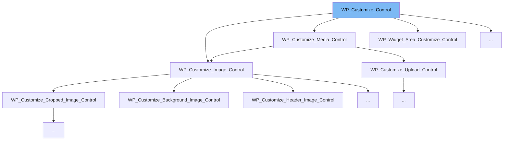

This document will cover the following topics related to the `WP_Customize_Control` class:

1. What is `WP_Customize_Control`?
2. The variables and functions defined in `WP_Customize_Control`.
3. An example of how `WP_Customize_Control` is used in `WP_Customize_Nav_Menu_Locations_Control`.



# What is WP_Customize_Control

`WP_Customize_Control` is a core WordPress class used in the Customizer. It provides a way to add controls to the Customizer's sections. These controls represent a single piece of data that the user can manipulate, such as a setting's value.

<SwmSnippet path="/wp-includes/class-wp-customize-control.php" line="26">

---

# Variables and functions

The variable `instance_count` is a static variable used to keep track of the number of instances of the `WP_Customize_Control` class. It is incremented each time a new instance of the class is created.

```hack
	protected static $instance_count = 0;
```

---

</SwmSnippet>

<SwmSnippet path="/wp-includes/class-wp-customize-control.php" line="34">

---

The variable `instance_number` stores the order in which this instance was created in relation to other instances.

```hack
	public $instance_number;
```

---

</SwmSnippet>

<SwmSnippet path="/wp-includes/class-wp-customize-control.php" line="42">

---

The variable `manager` is an instance of the `WP_Customize_Manager` class. It's used to bootstrap the Customizer.

```hack
	public $manager;
```

---

</SwmSnippet>

<SwmSnippet path="/wp-includes/class-wp-customize-control.php" line="50">

---

The variable `id` is a string that holds the Control ID.

```hack
	public $id;
```

---

</SwmSnippet>

<SwmSnippet path="/wp-includes/class-wp-customize-control.php" line="58">

---

The variable `settings` is an array that holds all settings tied to the control.

```hack
	public $settings;
```

---

</SwmSnippet>

<SwmSnippet path="/wp-includes/class-wp-customize-control.php" line="66">

---

The variable `setting` holds the primary setting for the control (if there is one).

```hack
	public $setting = 'default';
```

---

</SwmSnippet>

<SwmSnippet path="/wp-includes/class-wp-customize-control.php" line="93">

---

The variable `section` holds the section the control belongs to.

```hack
	public $section = '';
```

---

</SwmSnippet>

<SwmSnippet path="/wp-includes/class-wp-customize-control.php" line="117">

---

The variable `choices` is an array that holds the list of choices for 'radio' or 'select' type controls, where values are the keys, and labels are the values.

```hack
	public $choices = array();
```

---

</SwmSnippet>

<SwmSnippet path="/wp-includes/class-wp-customize-control.php" line="109">

---

The variable `description` is a string that holds the description for the control.

```hack
	public $description = '';
```

---

</SwmSnippet>

<SwmSnippet path="/wp-includes/class-wp-customize-control.php" line="379">

---

The function `get_content` is used to get the control's content for insertion into the Customizer pane.

```hack
	final public function get_content() {
		ob_start();
		$this->maybe_render();
		return trim( ob_get_clean() );
	}
```

---

</SwmSnippet>

<SwmSnippet path="/wp-includes/customize/class-wp-customize-nav-menu-locations-control.php" line="19">

---

# Usage example

`WP_Customize_Nav_Menu_Locations_Control` is an example of a class that extends `WP_Customize_Control`. It is used to create a control that allows users to set the locations of their navigation menus in the Customizer.

```hack
	/**
```

---

</SwmSnippet>

&nbsp;

*This is an auto-generated document by Swimm AI 🌊 and has not yet been verified by a human*

<SwmMeta version="3.0.0" repo-id="Z2l0aHViJTNBJTNBbXl3ZWJzaXRlZGVtbyUzQSUzQWdpbGFkbmF2b3Q=" repo-name="mywebsitedemo" doc-type="class"><sup>Powered by [Swimm](/)</sup></SwmMeta>
