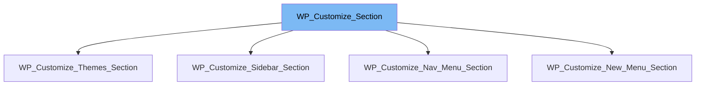

This document will cover the following topics related to the `WP_Customize_Section` class:

1. What is `WP_Customize_Section`?
2. Variables and functions in `WP_Customize_Section`.
3. An example of how `WP_Customize_Section` is used in `WP_Customize_Nav_Menu_Section`.



# What is WP_Customize_Section

`WP_Customize_Section` is a class in WordPress that acts as a UI container for controls in the WordPress Customizer. It is managed by the `WP_Customize_Manager` class. This class is used to create and manage sections in the WordPress Customizer, which are the UI components that group together related controls.

<SwmSnippet path="/wp-includes/class-wp-customize-section.php" line="30">

---

# Variables and functions

The static variable `$instance_count` is used to keep track of the number of instances of the `WP_Customize_Section` class. It is incremented each time a new instance of the class is created.

```hack
	protected static $instance_count = 0;
```

---

</SwmSnippet>

<SwmSnippet path="/wp-includes/class-wp-customize-section.php" line="38">

---

The variable `$instance_number` stores the order in which this instance was created in relation to other instances.

```hack
	public $instance_number;
```

---

</SwmSnippet>

<SwmSnippet path="/wp-includes/class-wp-customize-section.php" line="46">

---

The variable `$manager` holds an instance of the `WP_Customize_Manager` class.

```hack
	public $manager;
```

---

</SwmSnippet>

<SwmSnippet path="/wp-includes/class-wp-customize-section.php" line="54">

---

The variable `$id` is a unique identifier for the section.

```hack
	public $id;
```

---

</SwmSnippet>

<SwmSnippet path="/wp-includes/class-wp-customize-section.php" line="62">

---

The variable `$priority` determines the load order of sections. It is set to 160 by default.

```hack
	public $priority = 160;
```

---

</SwmSnippet>

<SwmSnippet path="/wp-includes/class-wp-customize-section.php" line="70">

---

The variable `$panel` is used to specify the panel in which to show the section, making it a sub-section.

```hack
	public $panel = '';
```

---

</SwmSnippet>

<SwmSnippet path="/wp-includes/class-wp-customize-section.php" line="78">

---

The variable `$capability` specifies the capability required for the section. By default, it is set to 'edit_theme_options'.

```hack
	public $capability = 'edit_theme_options';
```

---

</SwmSnippet>

<SwmSnippet path="/wp-includes/class-wp-customize-section.php" line="86">

---

The variable `$theme_supports` specifies the theme features required to support the section.

```hack
	public $theme_supports = '';
```

---

</SwmSnippet>

<SwmSnippet path="/wp-includes/class-wp-customize-section.php" line="94">

---

The variable `$title` is used to store the title of the section to show in the UI.

```hack
	public $title = '';
```

---

</SwmSnippet>

<SwmSnippet path="/wp-includes/class-wp-customize-section.php" line="102">

---

The variable `$description` is used to store the description of the section to show in the UI.

```hack
	public $description = '';
```

---

</SwmSnippet>

<SwmSnippet path="/wp-includes/class-wp-customize-section.php" line="110">

---

The variable `$controls` is an array that stores the Customizer controls for this section.

```hack
	public $controls;
```

---

</SwmSnippet>

<SwmSnippet path="/wp-includes/class-wp-customize-section.php" line="118">

---

The variable `$type` is used to specify the type of this section. By default, it is set to 'default'.

```hack
	public $type = 'default';
```

---

</SwmSnippet>

<SwmSnippet path="/wp-includes/class-wp-customize-section.php" line="132">

---

The variable `$active_callback` is a callback function that is called with one argument, the instance of `WP_Customize_Section`, and returns a boolean to indicate whether the section is active.

```hack
	public $active_callback = '';
```

---

</SwmSnippet>

<SwmSnippet path="/wp-includes/class-wp-customize-section.php" line="143">

---

The variable `$description_hidden` is a boolean that indicates whether the Section's description should be hidden behind a help icon in the Section header.

```hack
	public $description_hidden = false;
```

---

</SwmSnippet>

<SwmSnippet path="/wp-includes/customize/class-wp-customize-nav-menu-section.php" line="19">

---

# Usage example

`WP_Customize_Nav_Menu_Section` is an example of a class that extends `WP_Customize_Section`. This shows how `WP_Customize_Section` can be used to create a new section in the WordPress Customizer.

```hack
class WP_Customize_Nav_Menu_Section extends WP_Customize_Section {
```

---

</SwmSnippet>

&nbsp;

*This is an auto-generated document by Swimm AI 🌊 and has not yet been verified by a human*

<SwmMeta version="3.0.0" repo-id="Z2l0aHViJTNBJTNBbXl3ZWJzaXRlZGVtbyUzQSUzQWdpbGFkbmF2b3Q=" repo-name="mywebsitedemo" doc-type="class"><sup>Powered by [Swimm](/)</sup></SwmMeta>
