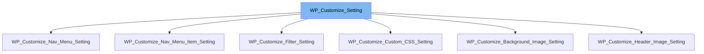

This document will cover the following aspects of the `WP_Customize_Setting` class:

1. What is `WP_Customize_Setting` and its purpose.
2. The variables and functions defined in `WP_Customize_Setting`.
3. An example of how `WP_Customize_Setting` is used in `WP_Customize_Filter_Setting`.



# What is WP_Customize_Setting

`WP_Customize_Setting` is a class in WordPress that handles the saving and sanitizing of settings. It is used in the WordPress Customizer, a framework for live-previewing changes to WordPress sites. The class provides a structured way to add, manipulate, and control settings in the Customizer.

<SwmSnippet path="/wp-includes/class-wp-customize-setting.php" line="22">

---

# Variables and functions in WP_Customize_Setting

The `manager` variable is an instance of `WP_Customize_Manager`. It's the bootstrap Customizer instance and is required for any Customizer component.

```hack
	/**
	 * Customizer bootstrap instance.
	 *
	 * @since 3.4.0
	 * @var WP_Customize_Manager
	 */
	public $manager;
```

---

</SwmSnippet>

<SwmSnippet path="/wp-includes/class-wp-customize-setting.php" line="30">

---

The `id` variable is a unique string identifier for the setting. It's used to differentiate each setting.

```hack
	/**
	 * Unique string identifier for the setting.
	 *
	 * @since 3.4.0
	 * @var string
	 */
	public $id;
```

---

</SwmSnippet>

<SwmSnippet path="/wp-includes/class-wp-customize-setting.php" line="38">

---

The `type` variable is used to define the type of the settings. It defaults to 'theme_mod'.

```hack
	/**
	 * Type of customize settings.
	 *
	 * @since 3.4.0
	 * @var string
	 */
	public $type = 'theme_mod';
```

---

</SwmSnippet>

<SwmSnippet path="/wp-includes/class-wp-customize-setting.php" line="520">

---

The `save` function checks user capabilities and theme supports, and then saves the value of the setting. It returns false if the capability check fails or the value isn't set or is invalid.

```hack
	final public function save() {
		$value = $this->post_value();

		if ( ! $this->check_capabilities() || ! isset( $value ) ) {
			return false;
		}

		$id_base = $this->id_data['base'];

		/**
		 * Fires when the WP_Customize_Setting::save() method is called.
		 *
		 * The dynamic portion of the hook name, `$id_base` refers to
		 * the base slug of the setting name.
		 *
		 * @since 3.4.0
		 *
		 * @param WP_Customize_Setting $setting WP_Customize_Setting instance.
		 */
		do_action( "customize_save_{$id_base}", $this );

```

---

</SwmSnippet>

<SwmSnippet path="/wp-includes/class-wp-customize-setting.php" line="730">

---

The `value` function fetches the value of the setting. It returns the value of the setting.

```hack
	/**
	 * Fetch the value of the setting.
	 *
	 * @since 3.4.0
	 *
	 * @return mixed The value.
	 */
	public function value() {
		$id_base      = $this->id_data['base'];
		$is_core_type = ( 'option' === $this->type || 'theme_mod' === $this->type );

		if ( ! $is_core_type && ! $this->is_multidimensional_aggregated ) {

			// Use post value if previewed and a post value is present.
			if ( $this->is_previewed ) {
				$value = $this->post_value( null );
				if ( null !== $value ) {
					return $value;
				}
			}

```

---

</SwmSnippet>

<SwmSnippet path="/wp-includes/customize/class-wp-customize-filter-setting.php" line="19">

---

# Usage example of WP_Customize_Setting in WP_Customize_Filter_Setting

`WP_Customize_Filter_Setting` is a subclass of `WP_Customize_Setting`. It extends the base class to add or modify functionality.

```hack
class WP_Customize_Filter_Setting extends WP_Customize_Setting {
```

---

</SwmSnippet>

&nbsp;

*This is an auto-generated document by Swimm AI 🌊 and has not yet been verified by a human*

<SwmMeta version="3.0.0" repo-id="Z2l0aHViJTNBJTNBbXl3ZWJzaXRlZGVtbyUzQSUzQWdpbGFkbmF2b3Q=" repo-name="mywebsitedemo" doc-type="class"><sup>Powered by [Swimm](/)</sup></SwmMeta>
