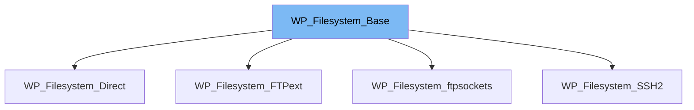

This document will cover the following aspects of the `WP_Filesystem_Base` class:

1. What is `WP_Filesystem_Base` and its purpose.
2. The variables and functions defined in `WP_Filesystem_Base`.
3. An example of how `WP_Filesystem_Base` is used in `WP_Filesystem_ftpsockets`.



# What is WP_Filesystem_Base

`WP_Filesystem_Base` is a base WordPress filesystem class which other filesystem implementations extend. It is part of the WordPress filesystem package and was introduced in WordPress 2.5.0. The class provides a set of methods for interacting with the filesystem, such as reading and writing files, changing permissions, and more. It is used as a foundation for other filesystem classes to build upon, providing a consistent set of functionalities for all filesystem operations in WordPress.

<SwmSnippet path="/wp-admin/includes/class-wp-filesystem-base.php" line="23">

---

# Variables and functions

The `verbose` variable is a boolean that determines whether to display debug data for the connection.

```hack
	public $verbose = false;
```

---

</SwmSnippet>

<SwmSnippet path="/wp-admin/includes/class-wp-filesystem-base.php" line="31">

---

The `cache` variable is an array that stores a cached list of local filepaths to mapped remote filepaths.

```hack
	public $cache = array();
```

---

</SwmSnippet>

<SwmSnippet path="/wp-admin/includes/class-wp-filesystem-base.php" line="39">

---

The `method` variable is a string that stores the access method of the current connection. It is set automatically.

```hack
	public $method = '';
```

---

</SwmSnippet>

<SwmSnippet path="/wp-admin/includes/class-wp-filesystem-base.php" line="57">

---

The `abspath` function returns the path on the remote filesystem of `ABSPATH`. It finds the folder of `ABSPATH` and checks if the FTP folder is rooted at the WordPress install.

```hack
	public function abspath() {
		$folder = $this->find_folder( ABSPATH );

		/*
		 * Perhaps the FTP folder is rooted at the WordPress install.
		 * Check for wp-includes folder in root. Could have some false positives, but rare.
		 */
		if ( ! $folder && $this->is_dir( '/' . WPINC ) ) {
			$folder = '/';
		}

		return $folder;
	}
```

---

</SwmSnippet>

<SwmSnippet path="/wp-admin/includes/class-wp-filesystem-base.php" line="78">

---

The `wp_content_dir` function returns the path on the remote filesystem of `WP_CONTENT_DIR` by finding the folder of `WP_CONTENT_DIR`.

```hack
	public function wp_content_dir() {
		return $this->find_folder( WP_CONTENT_DIR );
	}
```

---

</SwmSnippet>

<SwmSnippet path="/wp-admin/includes/class-wp-filesystem-base.php" line="89">

---

The `wp_plugins_dir` function returns the path on the remote filesystem of `WP_PLUGIN_DIR` by finding the folder of `WP_PLUGIN_DIR`.

```hack
	public function wp_plugins_dir() {
		return $this->find_folder( WP_PLUGIN_DIR );
	}
```

---

</SwmSnippet>

<SwmSnippet path="/wp-admin/includes/class-wp-filesystem-ftpsockets.php" line="16">

---

# Usage example

`WP_Filesystem_ftpsockets` is an example of a class that extends `WP_Filesystem_Base`, inheriting its methods for use in FTP socket connections.

```hack
class WP_Filesystem_ftpsockets extends WP_Filesystem_Base {
```

---

</SwmSnippet>

&nbsp;

*This is an auto-generated document by Swimm AI 🌊 and has not yet been verified by a human*

<SwmMeta version="3.0.0" repo-id="Z2l0aHViJTNBJTNBbXl3ZWJzaXRlZGVtbyUzQSUzQWdpbGFkbmF2b3Q=" repo-name="mywebsitedemo" doc-type="class"><sup>Powered by [Swimm](/)</sup></SwmMeta>
