```mermaid
graph TD;
  WP_List_Table:::currentBaseStyle
WP_List_Table --> WP_Comments_List_Table
WP_Comments_List_Table --> WP_Post_Comments_List_Table
WP_List_Table --> WP_Themes_List_Table
WP_Themes_List_Table --> WP_Theme_Install_List_Table
WP_List_Table --> WP_Privacy_Data_Removal_Requests_List_Table
WP_Privacy_Data_Removal_Requests_List_Table --> WP_Privacy_Data_Removal_Requests_Table
WP_List_Table --> 1[...]

 classDef currentBaseStyle color:#000000,fill:#7CB9F4

%% Swimm:
%% graph TD;
%%   WP_List_Table:::currentBaseStyle
%% <SwmToken path="/wp-admin/includes/class-wp-list-table.php" pos="301:7:7" line-data="		die( &#39;function WP_List_Table::prepare_items() must be overridden in a subclass.&#39; );">`WP_List_Table`</SwmToken> --> <SwmToken path="/wp-admin/includes/class-wp-comments-list-table.php" pos="17:2:2" line-data="class WP_Comments_List_Table extends WP_List_Table {">`WP_Comments_List_Table`</SwmToken>
%% <SwmToken path="/wp-admin/includes/class-wp-comments-list-table.php" pos="17:2:2" line-data="class WP_Comments_List_Table extends WP_List_Table {">`WP_Comments_List_Table`</SwmToken> --> <SwmToken path="/wp-admin/includes/class-wp-post-comments-list-table.php" pos="17:2:2" line-data="class WP_Post_Comments_List_Table extends WP_Comments_List_Table {">`WP_Post_Comments_List_Table`</SwmToken>
%% <SwmToken path="/wp-admin/includes/class-wp-list-table.php" pos="301:7:7" line-data="		die( &#39;function WP_List_Table::prepare_items() must be overridden in a subclass.&#39; );">`WP_List_Table`</SwmToken> --> <SwmToken path="/wp-admin/includes/class-wp-themes-list-table.php" pos="17:2:2" line-data="class WP_Themes_List_Table extends WP_List_Table {">`WP_Themes_List_Table`</SwmToken>
%% <SwmToken path="/wp-admin/includes/class-wp-themes-list-table.php" pos="17:2:2" line-data="class WP_Themes_List_Table extends WP_List_Table {">`WP_Themes_List_Table`</SwmToken> --> <SwmToken path="/wp-admin/includes/class-wp-theme-install-list-table.php" pos="17:2:2" line-data="class WP_Theme_Install_List_Table extends WP_Themes_List_Table {">`WP_Theme_Install_List_Table`</SwmToken>
%% <SwmToken path="/wp-admin/includes/class-wp-list-table.php" pos="301:7:7" line-data="		die( &#39;function WP_List_Table::prepare_items() must be overridden in a subclass.&#39; );">`WP_List_Table`</SwmToken> --> <SwmToken path="/wp-admin/includes/class-wp-privacy-data-removal-requests-list-table.php" pos="19:2:2" line-data="class WP_Privacy_Data_Removal_Requests_List_Table extends WP_Privacy_Requests_Table {">`WP_Privacy_Data_Removal_Requests_List_Table`</SwmToken>
%% <SwmToken path="/wp-admin/includes/class-wp-privacy-data-removal-requests-list-table.php" pos="19:2:2" line-data="class WP_Privacy_Data_Removal_Requests_List_Table extends WP_Privacy_Requests_Table {">`WP_Privacy_Data_Removal_Requests_List_Table`</SwmToken> --> <SwmToken path="/wp-admin/includes/deprecated.php" pos="1553:2:2" line-data="class WP_Privacy_Data_Removal_Requests_Table extends WP_Privacy_Data_Removal_Requests_List_Table {">`WP_Privacy_Data_Removal_Requests_Table`</SwmToken>
%% <SwmToken path="/wp-admin/includes/class-wp-list-table.php" pos="301:7:7" line-data="		die( &#39;function WP_List_Table::prepare_items() must be overridden in a subclass.&#39; );">`WP_List_Table`</SwmToken> --> 1[...]
%% 
%%  classDef currentBaseStyle color:#000000,fill:#7CB9F4
```

This document will cover the following aspects of the <SwmToken path="/wp-admin/includes/class-wp-list-table.php" pos="301:7:7" line-data="		die( &#39;function WP_List_Table::prepare_items() must be overridden in a subclass.&#39; );">`WP_List_Table`</SwmToken> class:

1. What is <SwmToken path="/wp-admin/includes/class-wp-list-table.php" pos="301:7:7" line-data="		die( &#39;function WP_List_Table::prepare_items() must be overridden in a subclass.&#39; );">`WP_List_Table`</SwmToken>
2. The main variables and functions of <SwmToken path="/wp-admin/includes/class-wp-list-table.php" pos="301:7:7" line-data="		die( &#39;function WP_List_Table::prepare_items() must be overridden in a subclass.&#39; );">`WP_List_Table`</SwmToken>
3. An example of how to use <SwmToken path="/wp-admin/includes/class-wp-list-table.php" pos="301:7:7" line-data="		die( &#39;function WP_List_Table::prepare_items() must be overridden in a subclass.&#39; );">`WP_List_Table`</SwmToken>



# What is <SwmToken path="/wp-admin/includes/class-wp-list-table.php" pos="301:7:7" line-data="		die( &#39;function WP_List_Table::prepare_items() must be overridden in a subclass.&#39; );">`WP_List_Table`</SwmToken>

<SwmToken path="/wp-admin/includes/class-wp-list-table.php" pos="301:7:7" line-data="		die( &#39;function WP_List_Table::prepare_items() must be overridden in a subclass.&#39; );">`WP_List_Table`</SwmToken> is a <SwmToken path="/wp-admin/includes/class-wp-list-table.php" pos="5:6:6" line-data=" * @package WordPress">`WordPress`</SwmToken> base class that is used for displaying a list of items in an ajaxified HTML table. It is primarily designed for the <SwmToken path="/wp-admin/includes/class-wp-list-table.php" pos="5:6:6" line-data=" * @package WordPress">`WordPress`</SwmToken> administration screens, but can be used in other parts of the site such as plugins. It provides a standardized way to display data in a table format, including pagination, sorting, and bulk actions.

<SwmSnippet path="/wp-admin/includes/class-wp-list-table.php" line="24">

---

# Variables and functions

The <SwmToken path="/wp-admin/includes/class-wp-list-table.php" pos="24:4:4" line-data="	public $items;">`items`</SwmToken> variable is used to store the current list of items that are being displayed in the table. It is an array that is populated by the <SwmToken path="/wp-admin/includes/class-wp-list-table.php" pos="300:5:5" line-data="	public function prepare_items() {">`prepare_items`</SwmToken> method.

```hack
	public $items;
```

---

</SwmSnippet>

<SwmSnippet path="/wp-admin/includes/class-wp-list-table.php" line="32">

---

The <SwmToken path="/wp-admin/includes/class-wp-list-table.php" pos="32:4:4" line-data="	protected $_args;">`_args`</SwmToken> variable is an array that holds various information about the current table. This includes the plural and singular labels for the items being listed, whether the table supports Ajax, and the current screen object.

```hack
	protected $_args;
```

---

</SwmSnippet>

<SwmSnippet path="/wp-admin/includes/class-wp-list-table.php" line="40">

---

The <SwmToken path="/wp-admin/includes/class-wp-list-table.php" pos="40:4:4" line-data="	protected $_pagination_args = array();">`_pagination_args`</SwmToken> variable is an array that holds various information needed for displaying the pagination. This includes the total number of items, the total number of pages, and the number of items per page.

```hack
	protected $_pagination_args = array();
```

---

</SwmSnippet>

<SwmSnippet path="/wp-admin/includes/class-wp-list-table.php" line="48">

---

The <SwmToken path="/wp-admin/includes/class-wp-list-table.php" pos="48:4:4" line-data="	protected $screen;">`screen`</SwmToken> variable is a <SwmToken path="/wp-admin/includes/class-wp-screen.php" pos="16:4:4" line-data="final class WP_Screen {">`WP_Screen`</SwmToken> object that represents the current screen. It is used to determine the current context of the table, such as the current post type or taxonomy.

```hack
	protected $screen;
```

---

</SwmSnippet>

<SwmSnippet path="/wp-admin/includes/class-wp-list-table.php" line="138">

---

The <SwmToken path="/wp-admin/includes/class-wp-list-table.php" pos="138:5:5" line-data="	public function __construct( $args = array() ) {">`__construct`</SwmToken> function is the constructor for the <SwmToken path="/wp-admin/includes/class-wp-list-table.php" pos="301:7:7" line-data="		die( &#39;function WP_List_Table::prepare_items() must be overridden in a subclass.&#39; );">`WP_List_Table`</SwmToken> class. It takes an array of arguments that can be used to override the default properties of the class. The constructor also sets up some default properties and actions.

```hack
	public function __construct( $args = array() ) {
		$args = wp_parse_args(
			$args,
			array(
				'plural'   => '',
				'singular' => '',
				'ajax'     => false,
				'screen'   => null,
			)
		);

		$this->screen = convert_to_screen( $args['screen'] );

		add_filter( "manage_{$this->screen->id}_columns", array( $this, 'get_columns' ), 0 );

		if ( ! $args['plural'] ) {
			$args['plural'] = $this->screen->base;
		}

		$args['plural']   = sanitize_key( $args['plural'] );
		$args['singular'] = sanitize_key( $args['singular'] );
```

---

</SwmSnippet>

<SwmSnippet path="/wp-admin/includes/class-wp-list-table.php" line="300">

---

The <SwmToken path="/wp-admin/includes/class-wp-list-table.php" pos="300:5:5" line-data="	public function prepare_items() {">`prepare_items`</SwmToken> function is an abstract function that must be overridden in a subclass. It is used to prepare the list of items for displaying.

```hack
	public function prepare_items() {
		die( 'function WP_List_Table::prepare_items() must be overridden in a subclass.' );
	}
```

---

</SwmSnippet>

<SwmSnippet path="/wp-admin/includes/class-wp-list-table.php" line="362">

---

The <SwmToken path="/wp-admin/includes/class-wp-list-table.php" pos="362:5:5" line-data="	public function has_items() {">`has_items`</SwmToken> function is used to determine whether the table has items to display or not. It returns true if there are items, and false otherwise.

```hack
	public function has_items() {
		return ! empty( $this->items );
	}
```

---

</SwmSnippet>

<SwmSnippet path="/wp-admin/includes/class-wp-ms-sites-list-table.php" line="17">

---

# Usage example

The <SwmToken path="/wp-admin/includes/class-wp-ms-sites-list-table.php" pos="17:2:2" line-data="class WP_MS_Sites_List_Table extends WP_List_Table {">`WP_MS_Sites_List_Table`</SwmToken> class is an example of a class that extends <SwmToken path="/wp-admin/includes/class-wp-ms-sites-list-table.php" pos="17:6:6" line-data="class WP_MS_Sites_List_Table extends WP_List_Table {">`WP_List_Table`</SwmToken>. It is used to display a list of sites in a multisite network.

```hack
class WP_MS_Sites_List_Table extends WP_List_Table {
```

---

</SwmSnippet>

&nbsp;

*This is an auto-generated document by Swimm AI 🌊 and has not yet been verified by a human*

<SwmMeta version="3.0.0" repo-id="Z2l0aHViJTNBJTNBbXl3ZWJzaXRlZGVtbyUzQSUzQWdpbGFkbmF2b3Q=" repo-name="mywebsitedemo"><sup>Powered by [Swimm](https://app.swimm.io/)</sup></SwmMeta>
