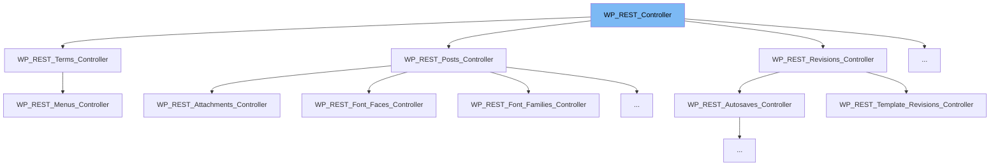

This document will cover the following aspects of the WP_REST_Controller class:

1. What is WP_REST_Controller
2. Variables and functions in WP_REST_Controller
3. Usage example of WP_REST_Controller



# What is WP_REST_Controller

The WP_REST_Controller is an abstract class in WordPress that serves as the base for managing and interacting with REST API items. It provides a structured way to add endpoints to the WordPress REST API, and it's meant to be extended for different resources of the API.

<SwmSnippet path="/wp-includes/rest-api/endpoints/class-wp-rest-controller.php" line="24">

---

# Variables in WP_REST_Controller

The `namespace` variable is used to store the namespace of this controller's route.

```hack
	protected $namespace;
```

---

</SwmSnippet>

<SwmSnippet path="/wp-includes/rest-api/endpoints/class-wp-rest-controller.php" line="32">

---

The `rest_base` variable is used to store the base of this controller's route.

```hack
	protected $rest_base;
```

---

</SwmSnippet>

<SwmSnippet path="/wp-includes/rest-api/endpoints/class-wp-rest-controller.php" line="40">

---

The `schema` variable is used to cache the results of get_item_schema.

```hack
	protected $schema;
```

---

</SwmSnippet>

<SwmSnippet path="/wp-includes/rest-api/endpoints/class-wp-rest-controller.php" line="49">

---

# Functions in WP_REST_Controller

The `register_routes` function is used to register the routes for the objects of the controller. This method must be overridden in the subclass.

```hack
	public function register_routes() {
		_doing_it_wrong(
			'WP_REST_Controller::register_routes',
			/* translators: %s: register_routes() */
			sprintf( __( "Method '%s' must be overridden." ), __METHOD__ ),
			'4.7.0'
		);
	}
```

---

</SwmSnippet>

<SwmSnippet path="/wp-includes/rest-api/endpoints/class-wp-rest-controller.php" line="83">

---

The `get_items` function is used to retrieve a collection of items. This method must be overridden in the subclass.

```hack
	public function get_items( $request ) {
		return new WP_Error(
			'invalid-method',
			/* translators: %s: Method name. */
			sprintf( __( "Method '%s' not implemented. Must be overridden in subclass." ), __METHOD__ ),
			array( 'status' => 405 )
		);
	}
```

---

</SwmSnippet>

<SwmSnippet path="/wp-includes/rest-api/endpoints/class-wp-rest-controller.php" line="117">

---

The `get_item` function is used to retrieve one item from the collection. This method must be overridden in the subclass.

```hack
	public function get_item( $request ) {
		return new WP_Error(
			'invalid-method',
			/* translators: %s: Method name. */
			sprintf( __( "Method '%s' not implemented. Must be overridden in subclass." ), __METHOD__ ),
			array( 'status' => 405 )
		);
	}
```

---

</SwmSnippet>

<SwmSnippet path="/wp-includes/rest-api/endpoints/class-wp-rest-controller.php" line="151">

---

The `create_item` function is used to create one item from the collection. This method must be overridden in the subclass.

```hack
	public function create_item( $request ) {
		return new WP_Error(
			'invalid-method',
			/* translators: %s: Method name. */
			sprintf( __( "Method '%s' not implemented. Must be overridden in subclass." ), __METHOD__ ),
			array( 'status' => 405 )
		);
	}
```

---

</SwmSnippet>

<SwmSnippet path="/wp-includes/rest-api/endpoints/class-wp-rest-controller.php" line="185">

---

The `update_item` function is used to update one item from the collection. This method must be overridden in the subclass.

```hack
	public function update_item( $request ) {
		return new WP_Error(
			'invalid-method',
			/* translators: %s: Method name. */
			sprintf( __( "Method '%s' not implemented. Must be overridden in subclass." ), __METHOD__ ),
			array( 'status' => 405 )
		);
	}
```

---

</SwmSnippet>

<SwmSnippet path="/wp-includes/rest-api/endpoints/class-wp-rest-controller.php" line="219">

---

The `delete_item` function is used to delete one item from the collection. This method must be overridden in the subclass.

```hack
	public function delete_item( $request ) {
		return new WP_Error(
			'invalid-method',
			/* translators: %s: Method name. */
			sprintf( __( "Method '%s' not implemented. Must be overridden in subclass." ), __METHOD__ ),
			array( 'status' => 405 )
		);
	}
```

---

</SwmSnippet>

# Usage example of WP_REST_Controller

The WP_REST_Controller class is abstract and is meant to be extended by other classes. An example of this is the WP_REST_Menu_Locations_Controller class, which extends WP_REST_Controller to manage menu locations in the WordPress REST API.

&nbsp;

*This is an auto-generated document by Swimm AI 🌊 and has not yet been verified by a human*

<SwmMeta version="3.0.0" repo-id="Z2l0aHViJTNBJTNBbXl3ZWJzaXRlZGVtbyUzQSUzQWdpbGFkbmF2b3Q=" repo-name="mywebsitedemo" doc-type="class"><sup>Powered by [Swimm](/)</sup></SwmMeta>
