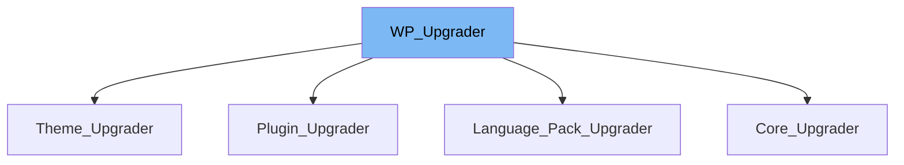

This document will cover the following topics:

1. What is WP_Upgrader
2. Variables and functions in WP_Upgrader
3. Usage example of WP_Upgrader



# What is WP_Upgrader

The `WP_Upgrader` class is a core WordPress class used for upgrading and installing a local set of files via the Filesystem Abstraction classes from a Zip file. It is used in various contexts such as upgrading or installing plugins, themes, language packs, and WordPress core itself.

<SwmSnippet path="/wp-admin/includes/class-wp-upgrader.php" line="60">

---

# Variables and functions

The `strings` variable is an array used to store the error/notification strings used to update the user on the progress of the upgrade/installation.

```hack
	public $strings = array();
```

---

</SwmSnippet>

<SwmSnippet path="/wp-admin/includes/class-wp-upgrader.php" line="68">

---

The `skin` variable is an instance of the `WP_Upgrader_Skin` or `Automatic_Upgrader_Skin` class. It is used to set the upgrader skin being used.

```hack
	public $skin = null;
```

---

</SwmSnippet>

<SwmSnippet path="/wp-admin/includes/class-wp-upgrader.php" line="93">

---

The `result` variable is used to store the result of the installation. It is set by `WP_Upgrader::install_package()`, only when the package is installed successfully.

```hack
	public $result = array();
```

---

</SwmSnippet>

<SwmSnippet path="/wp-admin/includes/class-wp-upgrader.php" line="103">

---

The `update_count` variable is an integer used to store the total number of updates being performed. It is set by the bulk update methods.

```hack
	public $update_count = 0;
```

---

</SwmSnippet>

<SwmSnippet path="/wp-admin/includes/class-wp-upgrader.php" line="113">

---

The `update_current` variable is an integer used to store the current update if multiple updates are being performed. It is used by the bulk update methods, and incremented for each update.

```hack
	public $update_current = 0;
```

---

</SwmSnippet>

<SwmSnippet path="/wp-admin/includes/class-wp-upgrader.php" line="143">

---

The `__construct()` function is used to construct the upgrader with a skin. It accepts an instance of `WP_Upgrader_Skin` as a parameter and assigns it to the `skin` variable.

```hack
	public function __construct( $skin = null ) {
		if ( null === $skin ) {
			$this->skin = new WP_Upgrader_Skin();
		} else {
			$this->skin = $skin;
		}
	}
```

---

</SwmSnippet>

<SwmSnippet path="/wp-admin/includes/class-wp-upgrader.php" line="162">

---

The `init()` function is used to initialize the upgrader. It sets the relationship between the skin being used and this upgrader, adds the generic strings to `WP_Upgrader::$strings`, and schedules a weekly task to clean up the temporary backup directory.

```hack
	public function init() {
		$this->skin->set_upgrader( $this );
		$this->generic_strings();

		if ( ! wp_installing() ) {
			$this->schedule_temp_backup_cleanup();
		}
	}
```

---

</SwmSnippet>

<SwmSnippet path="/wp-admin/includes/class-wp-upgrader.php" line="305">

---

The `download_package()` function is used to download a package. It accepts the URI of the package, a boolean to validate file signatures, and an array of extra arguments to pass to the filter hooks. It returns the full path to the downloaded package file, or a `WP_Error` object.

```hack
	public function download_package( $package, $check_signatures = false, $hook_extra = array() ) {
		/**
		 * Filters whether to return the package.
		 *
		 * @since 3.7.0
		 * @since 5.5.0 Added the `$hook_extra` parameter.
		 *
		 * @param bool        $reply      Whether to bail without returning the package.
		 *                                Default false.
		 * @param string      $package    The package file name.
		 * @param WP_Upgrader $upgrader   The WP_Upgrader instance.
		 * @param array       $hook_extra Extra arguments passed to hooked filters.
		 */
		$reply = apply_filters( 'upgrader_pre_download', false, $package, $this, $hook_extra );
		if ( false !== $reply ) {
			return $reply;
		}

		if ( ! preg_match( '!^(http|https|ftp)://!i', $package ) && file_exists( $package ) ) { // Local file or remote?
			return $package; // Must be a local file.
		}
```

---

</SwmSnippet>

<SwmSnippet path="/wp-admin/includes/class-wp-upgrader.php" line="354">

---

The `unpack_package()` function is used to unpack a compressed package file. It accepts the full path to the package file and a boolean whether to delete the package file after attempting to unpack it. It returns the path to the unpacked contents, or a `WP_Error` on failure.

```hack
	public function unpack_package( $package, $delete_package = true ) {
		global $wp_filesystem;

		$this->skin->feedback( 'unpack_package' );

		if ( ! $wp_filesystem->wp_content_dir() ) {
			return new WP_Error( 'fs_no_content_dir', $this->strings['fs_no_content_dir'] );
		}

		$upgrade_folder = $wp_filesystem->wp_content_dir() . 'upgrade/';

		// Clean up contents of upgrade directory beforehand.
		$upgrade_files = $wp_filesystem->dirlist( $upgrade_folder );
		if ( ! empty( $upgrade_files ) ) {
			foreach ( $upgrade_files as $file ) {
				$wp_filesystem->delete( $upgrade_folder . $file['name'], true );
			}
		}

		// We need a working directory - strip off any .tmp or .zip suffixes.
		$working_dir = $upgrade_folder . basename( basename( $package, '.tmp' ), '.zip' );
```

---

</SwmSnippet>

<SwmSnippet path="/wp-admin/includes/class-wp-upgrader.php" line="507">

---

The `install_package()` function is used to install a package. It copies the contents of a package from a source directory, and installs them in a destination directory. It can also optionally remove the source and clear out the destination folder if it already exists. It returns the result of the installation, or a `WP_Error` on failure.

```hack
	public function install_package( $args = array() ) {
		global $wp_filesystem, $wp_theme_directories;

		$defaults = array(
			'source'                      => '', // Please always pass this.
			'destination'                 => '', // ...and this.
			'clear_destination'           => false,
			'clear_working'               => false,
			'abort_if_destination_exists' => true,
			'hook_extra'                  => array(),
		);

		$args = wp_parse_args( $args, $defaults );

		// These were previously extract()'d.
		$source            = $args['source'];
		$destination       = $args['destination'];
		$clear_destination = $args['clear_destination'];

		if ( function_exists( 'set_time_limit' ) ) {
			set_time_limit( 300 );
```

---

</SwmSnippet>

<SwmSnippet path="/wp-admin/includes/class-core-upgrader.php" line="119">

---

# Usage example

Here is an example of how `WP_Upgrader` is used in the `Core_Upgrader` class. The `create_lock()` function is used to create a lock to prevent multiple Core Updates from occurring.

```hack
		$lock = WP_Upgrader::create_lock( 'core_updater', 15 * MINUTE_IN_SECONDS );
		if ( ! $lock ) {
```

---

</SwmSnippet>

<SwmSnippet path="/wp-admin/includes/class-core-upgrader.php" line="148">

---

If there is an error in downloading the package, the `release_lock()` function is used to release the lock.

```hack
			WP_Upgrader::release_lock( 'core_updater' );
			return $download;
```

---

</SwmSnippet>

&nbsp;

*This is an auto-generated document by Swimm AI 🌊 and has not yet been verified by a human*

<SwmMeta version="3.0.0" repo-id="Z2l0aHViJTNBJTNBbXl3ZWJzaXRlZGVtbyUzQSUzQWdpbGFkbmF2b3Q=" repo-name="mywebsitedemo" doc-type="class"><sup>Powered by [Swimm](/)</sup></SwmMeta>
