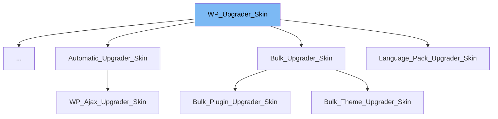

This document will cover the following aspects of the `WP_Upgrader_Skin` class:

1. What is `WP_Upgrader_Skin`.
2. Variables and functions of `WP_Upgrader_Skin`.
3. An example of how `WP_Upgrader_Skin` is used in `Plugin_Installer_Skin`.



# What is WP_Upgrader_Skin

`WP_Upgrader_Skin` is a generic skin for the WordPress Upgrader classes. It is designed to be extended for specific purposes. It is used to manage and control the visual aspects and flow of an upgrade process in WordPress.

<SwmSnippet path="/wp-admin/includes/class-wp-upgrader-skin.php" line="26">

---

# Variables and functions

The variable `upgrader` holds the upgrader data. It is of type `WP_Upgrader`.

```hack
	public $upgrader;
```

---

</SwmSnippet>

<SwmSnippet path="/wp-admin/includes/class-wp-upgrader-skin.php" line="62">

---

The variable `options` holds the options of an upgrade. It is an array.

```hack
	public $options = array();
```

---

</SwmSnippet>

<SwmSnippet path="/wp-admin/includes/class-wp-upgrader-skin.php" line="74">

---

The `__construct` function sets up the generic skin for the WordPress Upgrader classes. It takes an optional array of arguments to override default options.

```hack
	public function __construct( $args = array() ) {
		$defaults      = array(
			'url'     => '',
			'nonce'   => '',
			'title'   => '',
			'context' => false,
		);
		$this->options = wp_parse_args( $args, $defaults );
	}
```

---

</SwmSnippet>

<SwmSnippet path="/wp-admin/includes/class-wp-upgrader-skin.php" line="89">

---

The `set_upgrader` function is used to set the upgrader object and add strings. It takes a reference to a `WP_Upgrader` object as a parameter.

```hack
	public function set_upgrader( &$upgrader ) {
		if ( is_object( $upgrader ) ) {
			$this->upgrader =& $upgrader;
		}
		$this->add_strings();
	}
```

---

</SwmSnippet>

<SwmSnippet path="/wp-admin/includes/class-wp-upgrader-skin.php" line="146">

---

The `header` function is used to display the header of the upgrader skin.

```hack
	public function header() {
		if ( $this->done_header ) {
			return;
		}
		$this->done_header = true;
		echo '<div class="wrap">';
		echo '<h1>' . $this->options['title'] . '</h1>';
	}
```

---

</SwmSnippet>

<SwmSnippet path="/wp-admin/includes/class-wp-upgrader-skin.php" line="158">

---

The `footer` function is used to display the footer of the upgrader skin.

```hack
	public function footer() {
		if ( $this->done_footer ) {
			return;
		}
		$this->done_footer = true;
		echo '</div>';
	}
```

---

</SwmSnippet>

<SwmSnippet path="/wp-admin/includes/class-wp-upgrader-skin.php" line="171">

---

The `error` function is used to display errors. It takes a string or `WP_Error` object as a parameter.

```hack
	public function error( $errors ) {
		if ( ! $this->done_header ) {
			$this->header();
		}
		if ( is_string( $errors ) ) {
			$this->feedback( $errors );
		} elseif ( is_wp_error( $errors ) && $errors->has_errors() ) {
			foreach ( $errors->get_error_messages() as $message ) {
				if ( $errors->get_error_data() && is_string( $errors->get_error_data() ) ) {
					$this->feedback( $message . ' ' . esc_html( strip_tags( $errors->get_error_data() ) ) );
				} else {
					$this->feedback( $message );
				}
			}
		}
	}
```

---

</SwmSnippet>

<SwmSnippet path="/wp-admin/includes/class-plugin-installer-skin.php" line="18">

---

# Usage example

`Plugin_Installer_Skin` is an example of a class that extends `WP_Upgrader_Skin`. It uses the parent class to manage and control the visual aspects and flow of the plugin installation process.

```hack
class Plugin_Installer_Skin extends WP_Upgrader_Skin {
	public $api;
```

---

</SwmSnippet>

&nbsp;

*This is an auto-generated document by Swimm AI 🌊 and has not yet been verified by a human*

<SwmMeta version="3.0.0" repo-id="Z2l0aHViJTNBJTNBbXl3ZWJzaXRlZGVtbyUzQSUzQWdpbGFkbmF2b3Q=" repo-name="mywebsitedemo" doc-type="class"><sup>Powered by [Swimm](/)</sup></SwmMeta>
