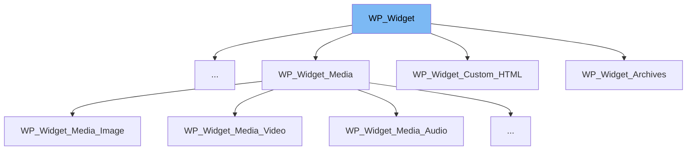

This document will cover the following topics related to the `WP_Widget` class in the WordPress project repository:

1. What is `WP_Widget` and its purpose.
2. The variables and functions defined in `WP_Widget`.
3. An example of how `WP_Widget` is used in `WP_Widget_Recent_Posts`.



# What is WP_Widget

`WP_Widget` is a core base class in WordPress that is extended to register widgets. Each widget must extend this class and override the `WP_Widget::widget()` method. If adding widget options, `WP_Widget::update()` and `WP_Widget::form()` should also be overridden. It was introduced in WordPress 2.8.0 and moved to its own file from `wp-includes/widgets.php` in WordPress 4.4.0.

<SwmSnippet path="/wp-includes/class-wp-widget.php" line="29">

---

# Variables and functions

The `id_base` variable is the root ID for all widgets of this type. It is a public variable and its value can be a mixed string.

```hack
	public $id_base;
```

---

</SwmSnippet>

<SwmSnippet path="/wp-includes/class-wp-widget.php" line="37">

---

The `name` variable is used to store the name for this widget type. It is a public variable and its value is a string.

```hack
	public $name;
```

---

</SwmSnippet>

<SwmSnippet path="/wp-includes/class-wp-widget.php" line="45">

---

The `option_name` variable is the option name for this widget type. It is a public variable and its value is a string.

```hack
	public $option_name;
```

---

</SwmSnippet>

<SwmSnippet path="/wp-includes/class-wp-widget.php" line="61">

---

The `widget_options` variable is an option array passed to `wp_register_sidebar_widget()`. It is a public variable and its value is an array.

```hack
	public $widget_options;
```

---

</SwmSnippet>

<SwmSnippet path="/wp-includes/class-wp-widget.php" line="69">

---

The `control_options` variable is an option array passed to `wp_register_widget_control()`. It is a public variable and its value is an array.

```hack
	public $control_options;
```

---

</SwmSnippet>

<SwmSnippet path="/wp-includes/class-wp-widget.php" line="113">

---

The `widget()` function is used to echo the widget content. This function must be overridden in a subclass.

```hack
	public function widget( $args, $instance ) {
		die( 'function WP_Widget::widget() must be overridden in a subclass.' );
	}
```

---

</SwmSnippet>

<SwmSnippet path="/wp-includes/class-wp-widget.php" line="131">

---

The `update()` function is used to update a particular instance of a widget. This function should check that `$new_instance` is set correctly. The newly-calculated value of `$instance` should be returned. If false is returned, the instance won't be saved/updated.

```hack
	public function update( $new_instance, $old_instance ) {
		return $new_instance;
	}
```

---

</SwmSnippet>

<SwmSnippet path="/wp-includes/class-wp-widget.php" line="143">

---

The `form()` function is used to output the settings update form. This function should be overridden in a subclass to display the form fields for the widget.

```hack
	public function form( $instance ) {
		echo '<p class="no-options-widget">' . __( 'There are no options for this widget.' ) . '</p>';
		return 'noform';
	}
```

---

</SwmSnippet>

<SwmSnippet path="/wp-includes/widgets/class-wp-widget-recent-posts.php" line="17">

---

# Usage example

`WP_Widget_Recent_Posts` is an example of a class that extends `WP_Widget`. It represents a widget for displaying recent posts.

```hack
class WP_Widget_Recent_Posts extends WP_Widget {
```

---

</SwmSnippet>

&nbsp;

*This is an auto-generated document by Swimm AI 🌊 and has not yet been verified by a human*

<SwmMeta version="3.0.0" repo-id="Z2l0aHViJTNBJTNBbXl3ZWJzaXRlZGVtbyUzQSUzQWdpbGFkbmF2b3Q=" repo-name="mywebsitedemo" doc-type="class"><sup>Powered by [Swimm](/)</sup></SwmMeta>
